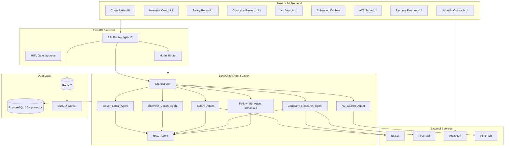
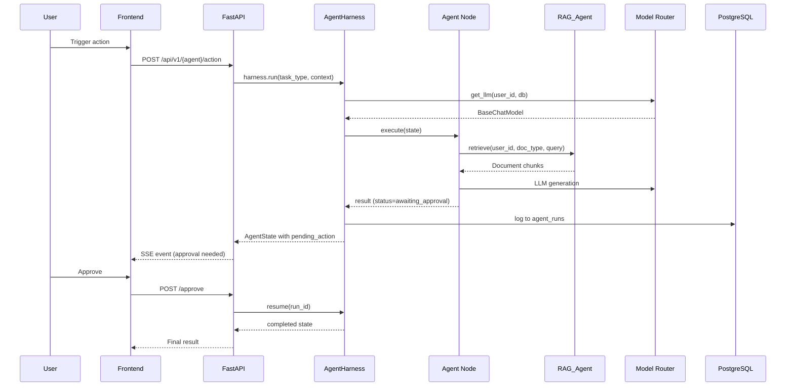

# Design Document: JobAgent Platform Enhancements

## Overview

This design document specifies the technical architecture for 10 platform enhancements to JobAgent AI: 5 new LangGraph agents (Cover Letter, Interview Coach, Salary Intelligence, Company Research, NL Job Search) and 5 feature upgrades (Enhanced Kanban, Smart Follow-Up, ATS Analyzer, Multi-Resume Profiles, LinkedIn Outreach).

All new agents follow the established harness pattern: registered in `harness.py` and `orchestrator.py`, LLM calls routed through `model_router.py`, actions logged to `agent_runs`, and HITL gates enforced server-side. The system extends the existing 4-layer architecture (Next.js → FastAPI → LangGraph → PostgreSQL/pgvector + Redis + PinchTab).

### Design Decisions

| Decision | Rationale |
|----------|-----------|
| New agents as LangGraph nodes (not standalone services) | Consistent with existing harness; shared state, memory, orchestrator routing |
| Extend existing `AgentState` TypedDict | Avoids state schema fragmentation; agents share context dict |
| New DB tables per feature (not JSONB blobs) | Type safety, indexing, RLS policies, query performance |
| BullMQ for long-running agent tasks | Existing worker infra; prevents HTTP timeout for research/search |
| Redis pub/sub + SSE for real-time updates | Already wired via `event_bus.py`; no new WebSocket infra |
| Keyword overlap scoring via pure Python | No ML model needed for persona matching; fast, deterministic, testable |

---

## Architecture

### High-Level System Diagram



### Agent Registration Pattern

Each new agent follows the existing pattern:

1. Create agent node file in `backend/app/agents/`
2. Register in `harness.py` (add to task_type routing)
3. Wire into `orchestrator.py` supervisor graph
4. Add API route in `backend/app/api/v1/`
5. Register router in `app/main.py`

### Agent Execution Flow



---

## Components and Interfaces

### New Backend Agent Modules

#### 1. Cover Letter Agent (`app/agents/cover_letter_agent.py`)

```python
from app.agents.state import AgentState
from app.services.rag_service import retrieve
from app.core.model_router import get_llm

VALID_TONES = {"formal", "casual", "bold"}

async def cover_letter_node(state: AgentState) -> AgentState:
    """LangGraph node for cover letter generation."""
    user_id = state["user_id"]
    context = state["context"]
    tone = context.get("tone", "formal")
    job_app_id = context["job_application_id"]

    if tone not in VALID_TONES:
        return {**state, "status": "failed", "error": f"Invalid tone: {tone}"}

    resume_chunks = retrieve(user_id, "resume", context["jd_text"], model_settings, k=5)
    jd_text = context["jd_text"]

    prompt = build_cover_letter_prompt(resume_chunks, jd_text, tone)
    llm = await get_llm(user_id, db)
    result = await llm.ainvoke(prompt)

    return {
        **state,
        "status": "awaiting_approval",
        "pending_action": {
            "type": "cover_letter_review",
            "content": result.content,
            "tone": tone,
            "job_application_id": job_app_id,
        },
    }
```

#### 2. Interview Coach Agent (`app/agents/interview_coach_agent.py`)

```python
QUESTION_TYPES = {"behavioral", "technical", "situational"}
RATING_LABELS = {"poor": (0, 25), "fair": (26, 50), "good": (51, 75), "excellent": (76, 100)}

async def start_session_node(state: AgentState) -> AgentState:
    """Generate interview questions for a role."""
    # Retrieve company intel if available
    company_intel = retrieve(user_id, "company", role, model_settings, k=3)
    questions = await generate_questions(llm, role, jd_text, company_intel, question_type_filter)

    if not question_type_filter:
        types_present = {q["type"] for q in questions}
        assert QUESTION_TYPES.issubset(types_present)
    return {**state, "result": {"questions": questions, "session_id": session_id}}

async def evaluate_answer_node(state: AgentState) -> AgentState:
    """Evaluate user answer: score 0-100, rating label, improvement tips."""
    answer_text = state["context"]["answer_text"]
    if len(answer_text.split()) < 10:
        return {**state, "status": "failed", "error": "Answer too short (min 10 words)"}
    evaluation = await evaluate_with_llm(llm, question, answer_text)
    return {**state, "result": evaluation}

def compute_rating_label(score: int) -> str:
    for label, (low, high) in RATING_LABELS.items():
        if low <= score <= high:
            return label
    return "poor"

def compute_session_summary(scores: list[int]) -> dict:
    overall = round(sum(scores) / len(scores)) if scores else 0
    return {"overall_score": overall, "count": len(scores)}
```

#### 3. Salary Agent (`app/agents/salary_agent.py`)

```python
from app.services.exa_service import ExaService

class OfferClassification(str, Enum):
    BELOW_MARKET = "below_market"
    AT_MARKET = "at_market"
    ABOVE_MARKET = "above_market"

def classify_offer(offer: int, p25: int, p50: int, p75: int) -> OfferClassification:
    """Pure function: classify offer against market percentiles."""
    if offer < p25:
        return OfferClassification.BELOW_MARKET
    elif offer > p75:
        return OfferClassification.ABOVE_MARKET
    return OfferClassification.AT_MARKET

async def salary_report_node(state: AgentState) -> AgentState:
    """Query Exa for salary data, generate negotiation script."""
    role, company, location = context["role"], context["company"], context["location"]
    salary_data = await exa_service.search_salary(role, company, location)

    if not salary_data:
        return {**state, "status": "completed", "result": {
            "data_unavailable": True, "role": role, "location": location
        }}

    percentiles = extract_percentiles(salary_data)  # {p25, p50, p75}
    classification = classify_offer(context.get("offer"), **percentiles)
    script = await generate_negotiation_script(llm, role, company, percentiles, classification)

    return {**state, "status": "awaiting_approval", "pending_action": {
        "type": "salary_report_review",
        "report": {**percentiles, "classification": classification},
        "script": script,
    }}
```

#### 4. Company Research Agent (`app/agents/company_research_agent.py`)

```python
REQUIRED_SOURCES = ["website", "news", "tech_stack", "glassdoor"]
CACHE_TTL_DAYS = 7

@dataclass
class CompanyIntel:
    company_name: str
    overview: str
    culture_summary: str
    news_items: list[dict]  # min 3
    tech_stack: list[str]
    glassdoor_sentiment: Literal["positive", "neutral", "negative"]
    partial_data: dict[str, str] | None  # source -> error message
    researched_at: datetime

async def company_research_node(state: AgentState) -> AgentState:
    """Research company from multiple sources, store in pgvector."""
    company_name = state["context"]["company_name"]
    force_refresh = state["context"].get("force_refresh", False)

    # Cache check: return cached if < 7 days old
    existing = await get_cached_intel(user_id, company_name)
    if existing and not force_refresh:
        age = datetime.utcnow() - existing.researched_at
        if age.days < CACHE_TTL_DAYS:
            return {**state, "status": "completed", "result": existing.to_dict()}

    # Fetch from all sources, tolerating individual failures
    results, failures = await fetch_all_sources(company_name)
    intel = compile_intel(company_name, results, failures)

    # Embed in pgvector + persist structured JSON
    await embed_company_intel(user_id, intel, model_settings)
    await save_intel_snapshot(user_id, intel)
    return {**state, "status": "completed", "result": intel.to_dict()}
```

#### 5. NL Search Agent (`app/agents/nl_search_agent.py`)

```python
@dataclass
class SearchParameters:
    role_title: str | None
    seniority: str | None
    location: str | None
    remote_preference: str | None
    industry: str | None
    salary_range: tuple[int, int] | None
    company_size: str | None
    tech_stack: list[str]
    additional_constraints: list[str]

async def nl_search_node(state: AgentState) -> AgentState:
    """Parse natural language query into structured search parameters."""
    query = state["context"]["query"]
    params: SearchParameters = await extract_parameters(llm, query)

    if not params.role_title:
        return {**state, "status": "failed",
                "error": "Could not identify a role title. Please include a job title."}

    return {**state, "status": "awaiting_approval", "pending_action": {
        "type": "search_confirmation",
        "interpretation": params.to_dict(),
        "original_query": query,
    }}
```

### New API Routes

| Route | Method | Handler | Description |
|-------|--------|---------|-------------|
| `/api/v1/cover-letter/generate` | POST | `cover_letter.py` | Generate cover letter |
| `/api/v1/cover-letter/{app_id}/history` | GET | `cover_letter.py` | Version history |
| `/api/v1/interview/session/start` | POST | `interview.py` | Start mock interview |
| `/api/v1/interview/session/{id}/answer` | POST | `interview.py` | Submit answer |
| `/api/v1/interview/session/{id}/summary` | GET | `interview.py` | Session summary |
| `/api/v1/salary/report` | POST | `salary.py` | Generate salary report |
| `/api/v1/salary/report/{id}` | GET | `salary.py` | Get report |
| `/api/v1/company/research` | POST | `company.py` | Trigger research |
| `/api/v1/company/{name}/intel` | GET | `company.py` | Get cached intel |
| `/api/v1/jobs/search/natural` | POST | `jobs.py` (extend) | NL job search |
| `/api/v1/resume/ats-score` | POST | `resume.py` (extend) | ATS analysis |
| `/api/v1/resume/personas` | GET/POST | `resume.py` (extend) | List/create personas |
| `/api/v1/resume/personas/{id}` | PUT/DELETE | `resume.py` (extend) | Update/delete persona |
| `/api/v1/linkedin/outreach/identify` | POST | `linkedin.py` (extend) | Find contacts |
| `/api/v1/linkedin/outreach/queue` | GET | `linkedin.py` (extend) | View queue |
| `/api/v1/linkedin/outreach/{id}/approve` | POST | `linkedin.py` (extend) | Approve message |

### New Frontend Pages/Components

| Path | Component | Feature |
|------|-----------|---------|
| `/cover-letter` | `CoverLetterGenerator` | Cover letter + history |
| `/interview` | `InterviewCoach` | Mock interview sessions |
| `/salary` | `SalaryReport` | Salary intelligence |
| `/company/{name}` | `CompanyIntelView` | Company research |
| `/applications` (enhanced) | `KanbanBoard` | Drag-drop + timeline |
| `/resume/optimize` (enhanced) | `ATSScorePanel` | ATS score breakdown |
| `/resume/versions` (enhanced) | `PersonaManager` | Multi-resume personas |
| `/linkedin/outreach` | `OutreachQueue` | Message queue + approval |

### Key Pure Functions (Testable)

```python
# salary_agent.py
def classify_offer(offer: int, p25: int, p50: int, p75: int) -> str: ...

# interview_coach_agent.py
def compute_rating_label(score: int) -> str: ...
def compute_session_summary(scores: list[int]) -> dict: ...

# resume_persona_service.py
def compute_keyword_overlap(persona_keywords: list[str], jd_keywords: list[str]) -> float: ...
def select_best_persona(personas: list[Persona], jd_text: str) -> tuple[Persona, float]: ...

# ats_service.py (enhanced)
def compute_ats_score(resume_text: str, jd_text: str) -> AtsScoreResult: ...
def compute_weighted_composite(keyword: int, readability: int, format_: int) -> int: ...

# linkedin_outreach_service.py
def filter_contacts_by_title(contacts: list[dict], filter_keywords: list[str]) -> list[dict]: ...
def validate_message_length(message: str, max_chars: int = 300) -> bool: ...

# activity_timeline_service.py
def sort_events_chronologically(events: list[dict]) -> list[dict]: ...

# nl_search_agent.py
def validate_search_params(params: SearchParameters) -> bool: ...
```

---

## Data Models

### New Database Tables

#### Migration: `0011_cover_letter_versions.sql`

```sql
ALTER TABLE job_applications ADD COLUMN cover_letter_id UUID REFERENCES user_documents(id);

CREATE TABLE cover_letter_versions (
    id UUID PRIMARY KEY DEFAULT gen_random_uuid(),
    user_id UUID NOT NULL REFERENCES users(id) ON DELETE CASCADE,
    job_application_id UUID NOT NULL REFERENCES job_applications(id) ON DELETE CASCADE,
    document_id UUID NOT NULL REFERENCES user_documents(id) ON DELETE CASCADE,
    tone VARCHAR(10) NOT NULL CHECK (tone IN ('formal', 'casual', 'bold')),
    version_number INTEGER NOT NULL DEFAULT 1,
    created_at TIMESTAMPTZ NOT NULL DEFAULT now(),
    UNIQUE(job_application_id, version_number)
);
CREATE INDEX idx_clv_app ON cover_letter_versions(job_application_id, created_at DESC);
```

#### Migration: `0012_interview_sessions.sql`

```sql
CREATE TABLE interview_sessions (
    id UUID PRIMARY KEY DEFAULT gen_random_uuid(),
    user_id UUID NOT NULL REFERENCES users(id) ON DELETE CASCADE,
    job_application_id UUID REFERENCES job_applications(id),
    role VARCHAR(255) NOT NULL,
    company VARCHAR(255),
    questions JSONB NOT NULL DEFAULT '[]',
    answers JSONB NOT NULL DEFAULT '[]',
    scores JSONB NOT NULL DEFAULT '[]',
    overall_score INTEGER,
    summary JSONB,
    status VARCHAR(20) NOT NULL DEFAULT 'in_progress',
    started_at TIMESTAMPTZ NOT NULL DEFAULT now(),
    completed_at TIMESTAMPTZ
);
CREATE INDEX idx_is_user ON interview_sessions(user_id, created_at DESC);
```

#### Migration: `0013_salary_reports.sql`

```sql
CREATE TABLE salary_reports (
    id UUID PRIMARY KEY DEFAULT gen_random_uuid(),
    user_id UUID NOT NULL REFERENCES users(id) ON DELETE CASCADE,
    job_application_id UUID REFERENCES job_applications(id),
    role VARCHAR(255) NOT NULL,
    company VARCHAR(255),
    location VARCHAR(255) NOT NULL,
    p25 INTEGER NOT NULL,
    p50 INTEGER NOT NULL,
    p75 INTEGER NOT NULL,
    offer_amount INTEGER,
    classification VARCHAR(20),
    negotiation_script JSONB,
    data_sources JSONB NOT NULL DEFAULT '[]',
    data_unavailable BOOLEAN NOT NULL DEFAULT false,
    created_at TIMESTAMPTZ NOT NULL DEFAULT now()
);
CREATE INDEX idx_sr_user ON salary_reports(user_id, created_at DESC);
```

#### Migration: `0014_company_intel.sql`

```sql
CREATE TABLE company_intel (
    id UUID PRIMARY KEY DEFAULT gen_random_uuid(),
    user_id UUID NOT NULL REFERENCES users(id) ON DELETE CASCADE,
    company_name VARCHAR(255) NOT NULL,
    overview TEXT,
    culture_summary TEXT,
    news_items JSONB NOT NULL DEFAULT '[]',
    tech_stack JSONB NOT NULL DEFAULT '[]',
    glassdoor_sentiment VARCHAR(10),
    partial_data JSONB,
    researched_at TIMESTAMPTZ NOT NULL DEFAULT now(),
    UNIQUE(user_id, company_name)
);
CREATE INDEX idx_ci_lookup ON company_intel(user_id, company_name);
```

#### Migration: `0015_resume_personas.sql`

```sql
CREATE TABLE resume_personas (
    id UUID PRIMARY KEY DEFAULT gen_random_uuid(),
    user_id UUID NOT NULL REFERENCES users(id) ON DELETE CASCADE,
    name VARCHAR(100) NOT NULL,
    description TEXT,
    primary_resume_id UUID REFERENCES user_documents(id) ON DELETE SET NULL,
    target_keywords TEXT[] NOT NULL DEFAULT '{}',
    created_at TIMESTAMPTZ NOT NULL DEFAULT now(),
    updated_at TIMESTAMPTZ NOT NULL DEFAULT now()
);
CREATE INDEX idx_rp_user ON resume_personas(user_id);

-- Trigger to enforce max 10 personas per user
CREATE OR REPLACE FUNCTION check_max_personas() RETURNS TRIGGER AS $$
BEGIN
    IF (SELECT COUNT(*) FROM resume_personas WHERE user_id = NEW.user_id) >= 10 THEN
        RAISE EXCEPTION 'Maximum 10 resume personas per user';
    END IF;
    RETURN NEW;
END;
$$ LANGUAGE plpgsql;
CREATE TRIGGER trg_max_personas BEFORE INSERT ON resume_personas
    FOR EACH ROW EXECUTE FUNCTION check_max_personas();
```

#### Migration: `0016_linkedin_outreach_queue.sql`

```sql
CREATE TABLE linkedin_outreach_queue (
    id UUID PRIMARY KEY DEFAULT gen_random_uuid(),
    user_id UUID NOT NULL REFERENCES users(id) ON DELETE CASCADE,
    company VARCHAR(255) NOT NULL,
    contact_name VARCHAR(255) NOT NULL,
    contact_title VARCHAR(255),
    contact_linkedin_url TEXT,
    message TEXT NOT NULL,
    status VARCHAR(20) NOT NULL DEFAULT 'pending_approval'
        CHECK (status IN ('pending_approval', 'approved', 'sent', 'rejected', 'edited')),
    approved_at TIMESTAMPTZ,
    sent_at TIMESTAMPTZ,
    created_at TIMESTAMPTZ NOT NULL DEFAULT now()
);
CREATE INDEX idx_loq_user_status ON linkedin_outreach_queue(user_id, status);
```

#### Migration: `0017_ats_scores.sql`

```sql
CREATE TABLE ats_scores (
    id UUID PRIMARY KEY DEFAULT gen_random_uuid(),
    user_id UUID NOT NULL REFERENCES users(id) ON DELETE CASCADE,
    resume_id UUID REFERENCES user_documents(id) ON DELETE SET NULL,
    job_application_id UUID REFERENCES job_applications(id),
    composite_score INTEGER NOT NULL,
    keyword_score INTEGER NOT NULL,
    readability_score INTEGER NOT NULL,
    format_score INTEGER NOT NULL,
    missing_keywords JSONB NOT NULL DEFAULT '[]',
    suggestions JSONB NOT NULL DEFAULT '[]',
    flesch_kincaid FLOAT,
    avg_sentence_length FLOAT,
    format_checks JSONB NOT NULL DEFAULT '{}',
    scored_at TIMESTAMPTZ NOT NULL DEFAULT now()
);
CREATE INDEX idx_ats_user ON ats_scores(user_id, scored_at DESC);
```

### SQLAlchemy ORM Models (additions to `app/models/db.py`)

```python
class CoverLetterVersion(Base):
    __tablename__ = "cover_letter_versions"
    id: Mapped[uuid.UUID] = mapped_column(UUID(as_uuid=True), primary_key=True, default=uuid.uuid4)
    user_id: Mapped[uuid.UUID] = mapped_column(ForeignKey("users.id", ondelete="CASCADE"))
    job_application_id: Mapped[uuid.UUID] = mapped_column(ForeignKey("job_applications.id"))
    document_id: Mapped[uuid.UUID] = mapped_column(ForeignKey("user_documents.id"))
    tone: Mapped[str] = mapped_column(String(10), nullable=False)
    version_number: Mapped[int] = mapped_column(Integer, default=1)
    created_at: Mapped[datetime] = mapped_column(DateTime(timezone=True), server_default=func.now())

class InterviewSession(Base):
    __tablename__ = "interview_sessions"
    id: Mapped[uuid.UUID] = mapped_column(UUID(as_uuid=True), primary_key=True, default=uuid.uuid4)
    user_id: Mapped[uuid.UUID] = mapped_column(ForeignKey("users.id", ondelete="CASCADE"))
    role: Mapped[str] = mapped_column(String(255), nullable=False)
    company: Mapped[str | None] = mapped_column(String(255))
    questions: Mapped[list] = mapped_column(JSONB, default=list)
    answers: Mapped[list] = mapped_column(JSONB, default=list)
    scores: Mapped[list] = mapped_column(JSONB, default=list)
    overall_score: Mapped[int | None] = mapped_column(Integer)
    summary: Mapped[dict | None] = mapped_column(JSONB)
    status: Mapped[str] = mapped_column(String(20), default="in_progress")
    started_at: Mapped[datetime] = mapped_column(DateTime(timezone=True), server_default=func.now())
    completed_at: Mapped[datetime | None] = mapped_column(DateTime(timezone=True))

class SalaryReport(Base):
    __tablename__ = "salary_reports"
    id: Mapped[uuid.UUID] = mapped_column(UUID(as_uuid=True), primary_key=True, default=uuid.uuid4)
    user_id: Mapped[uuid.UUID] = mapped_column(ForeignKey("users.id", ondelete="CASCADE"))
    role: Mapped[str] = mapped_column(String(255), nullable=False)
    company: Mapped[str | None] = mapped_column(String(255))
    location: Mapped[str] = mapped_column(String(255), nullable=False)
    p25: Mapped[int] = mapped_column(Integer, nullable=False)
    p50: Mapped[int] = mapped_column(Integer, nullable=False)
    p75: Mapped[int] = mapped_column(Integer, nullable=False)
    offer_amount: Mapped[int | None] = mapped_column(Integer)
    classification: Mapped[str | None] = mapped_column(String(20))
    negotiation_script: Mapped[dict | None] = mapped_column(JSONB)
    data_unavailable: Mapped[bool] = mapped_column(Boolean, default=False)
    created_at: Mapped[datetime] = mapped_column(DateTime(timezone=True), server_default=func.now())

class CompanyIntelModel(Base):
    __tablename__ = "company_intel"
    id: Mapped[uuid.UUID] = mapped_column(UUID(as_uuid=True), primary_key=True, default=uuid.uuid4)
    user_id: Mapped[uuid.UUID] = mapped_column(ForeignKey("users.id", ondelete="CASCADE"))
    company_name: Mapped[str] = mapped_column(String(255), nullable=False)
    overview: Mapped[str | None] = mapped_column(Text)
    culture_summary: Mapped[str | None] = mapped_column(Text)
    news_items: Mapped[list] = mapped_column(JSONB, default=list)
    tech_stack: Mapped[list] = mapped_column(JSONB, default=list)
    glassdoor_sentiment: Mapped[str | None] = mapped_column(String(10))
    partial_data: Mapped[dict | None] = mapped_column(JSONB)
    researched_at: Mapped[datetime] = mapped_column(DateTime(timezone=True), server_default=func.now())

class ResumePersona(Base):
    __tablename__ = "resume_personas"
    id: Mapped[uuid.UUID] = mapped_column(UUID(as_uuid=True), primary_key=True, default=uuid.uuid4)
    user_id: Mapped[uuid.UUID] = mapped_column(ForeignKey("users.id", ondelete="CASCADE"))
    name: Mapped[str] = mapped_column(String(100), nullable=False)
    description: Mapped[str | None] = mapped_column(Text)
    primary_resume_id: Mapped[uuid.UUID | None] = mapped_column(ForeignKey("user_documents.id"))
    target_keywords: Mapped[list] = mapped_column(JSONB, default=list)
    created_at: Mapped[datetime] = mapped_column(DateTime(timezone=True), server_default=func.now())
    updated_at: Mapped[datetime] = mapped_column(DateTime(timezone=True), server_default=func.now())

class LinkedInOutreachQueue(Base):
    __tablename__ = "linkedin_outreach_queue"
    id: Mapped[uuid.UUID] = mapped_column(UUID(as_uuid=True), primary_key=True, default=uuid.uuid4)
    user_id: Mapped[uuid.UUID] = mapped_column(ForeignKey("users.id", ondelete="CASCADE"))
    company: Mapped[str] = mapped_column(String(255), nullable=False)
    contact_name: Mapped[str] = mapped_column(String(255), nullable=False)
    contact_title: Mapped[str | None] = mapped_column(String(255))
    contact_linkedin_url: Mapped[str | None] = mapped_column(Text)
    message: Mapped[str] = mapped_column(Text, nullable=False)
    status: Mapped[str] = mapped_column(String(20), default="pending_approval")
    approved_at: Mapped[datetime | None] = mapped_column(DateTime(timezone=True))
    sent_at: Mapped[datetime | None] = mapped_column(DateTime(timezone=True))
    created_at: Mapped[datetime] = mapped_column(DateTime(timezone=True), server_default=func.now())

class AtsScore(Base):
    __tablename__ = "ats_scores"
    id: Mapped[uuid.UUID] = mapped_column(UUID(as_uuid=True), primary_key=True, default=uuid.uuid4)
    user_id: Mapped[uuid.UUID] = mapped_column(ForeignKey("users.id", ondelete="CASCADE"))
    resume_id: Mapped[uuid.UUID | None] = mapped_column(ForeignKey("user_documents.id"))
    job_application_id: Mapped[uuid.UUID | None] = mapped_column(ForeignKey("job_applications.id"))
    composite_score: Mapped[int] = mapped_column(Integer, nullable=False)
    keyword_score: Mapped[int] = mapped_column(Integer, nullable=False)
    readability_score: Mapped[int] = mapped_column(Integer, nullable=False)
    format_score: Mapped[int] = mapped_column(Integer, nullable=False)
    missing_keywords: Mapped[list] = mapped_column(JSONB, default=list)
    suggestions: Mapped[list] = mapped_column(JSONB, default=list)
    scored_at: Mapped[datetime] = mapped_column(DateTime(timezone=True), server_default=func.now())
```

### Pydantic Request/Response Schemas

```python
# Cover Letter
class CoverLetterRequest(BaseModel):
    job_application_id: uuid.UUID
    tone: Literal["formal", "casual", "bold"] = "formal"

class CoverLetterResponse(BaseModel):
    id: uuid.UUID
    content: str
    tone: str
    version_number: int
    created_at: datetime

# Interview
class InterviewStartRequest(BaseModel):
    role: str
    company: str | None = None
    job_application_id: uuid.UUID | None = None
    question_type: Literal["behavioral", "technical", "situational"] | None = None

class AnswerSubmitRequest(BaseModel):
    answer_text: str = Field(min_length=10)

class AnswerEvaluation(BaseModel):
    score: int = Field(ge=0, le=100)
    rating: Literal["poor", "fair", "good", "excellent"]
    tips: list[str] = Field(min_length=1)

# Salary
class SalaryReportRequest(BaseModel):
    role: str
    company: str | None = None
    location: str
    offer_amount: int | None = None
    job_application_id: uuid.UUID | None = None

class SalaryReportResponse(BaseModel):
    p25: int
    p50: int
    p75: int
    classification: str | None
    negotiation_script: dict | None
    data_unavailable: bool = False

# Company Research
class CompanyResearchRequest(BaseModel):
    company_name: str
    force_refresh: bool = False

# NL Search
class NLSearchRequest(BaseModel):
    query: str = Field(min_length=5, max_length=500)

class SearchInterpretation(BaseModel):
    role_title: str | None
    seniority: str | None
    location: str | None
    remote_preference: str | None
    salary_range: tuple[int, int] | None
    tech_stack: list[str] = []

# Resume Persona
class PersonaCreate(BaseModel):
    name: str = Field(max_length=100)
    description: str | None = None
    primary_resume_id: uuid.UUID | None = None
    target_keywords: list[str] = Field(max_length=50)

# ATS Score
class ATSScoreRequest(BaseModel):
    resume_text: str = Field(min_length=100)
    jd_text: str = Field(min_length=100)
    resume_id: uuid.UUID | None = None
    job_application_id: uuid.UUID | None = None

# LinkedIn Outreach
class OutreachIdentifyRequest(BaseModel):
    company: str
    role_context: str | None = None
```

---

## Correctness Properties

*A property is a characteristic or behavior that should hold true across all valid executions of a system — essentially, a formal statement about what the system should do. Properties serve as the bridge between human-readable specifications and machine-verifiable correctness guarantees.*

### Property 1: Tone validation is exhaustive

*For any* string value passed as a tone parameter to the Cover Letter Agent, the system SHALL accept the value if and only if it is one of `"formal"`, `"casual"`, or `"bold"` — all other values SHALL be rejected with an error.

**Validates: Requirements 1.2**

### Property 2: Cover letter version ordering

*For any* job application with N cover letter versions (N ≥ 1), retrieving the version history SHALL return all N versions sorted by `created_at` in strictly descending order.

**Validates: Requirements 1.5, 1.6**

### Property 3: HITL gate state transition

*For any* agent action requiring human approval (cover letter, salary script, follow-up email, LinkedIn message, search confirmation), execution SHALL transition through `awaiting_approval` before `completed` — no outbound action occurs without this state.

**Validates: Requirements 1.9, 3.10, 7.6, 10.6**

### Property 4: Interview question type coverage

*For any* mock interview session started without a `question_type` filter, the generated question set SHALL contain at least one question of each type: `behavioral`, `technical`, and `situational`.

**Validates: Requirements 2.1**

### Property 5: Question type filter exclusivity

*For any* session started with a `question_type` filter T, every question in the set SHALL have type equal to T.

**Validates: Requirements 2.2**

### Property 6: Answer evaluation bounds and rating consistency

*For any* answer evaluation, the score SHALL be in [0, 100], the rating label SHALL match its score range (poor: 0-25, fair: 26-50, good: 51-75, excellent: 76-100), and tips SHALL be non-empty.

**Validates: Requirements 2.3**

### Property 7: Session summary is arithmetic mean

*For any* completed session with scores [s₁..sₙ], overall_score SHALL equal round(mean(s₁..sₙ)).

**Validates: Requirements 2.5**

### Property 8: Short answer rejection

*For any* answer text with fewer than 10 words, the system SHALL reject with HTTP 422.

**Validates: Requirements 2.11**

### Property 9: Salary percentile ordering

*For any* Salary Report where data_unavailable is false, p25 ≤ p50 ≤ p75 and all are positive integers.

**Validates: Requirements 3.2**

### Property 10: Offer classification correctness

*For any* (offer, p25, p50, p75) tuple, classification SHALL be `below_market` when offer < p25, `at_market` when p25 ≤ offer ≤ p75, `above_market` when offer > p75.

**Validates: Requirements 3.3**

### Property 11: Negotiation script structure

*For any* complete Salary Report, the script SHALL contain: opening statement, counter-offer == p75, and ≥ 2 justification points.

**Validates: Requirements 3.4**

### Property 12: Company Intel structure completeness

*For any* Company Intel object, it SHALL contain non-null: overview, culture_summary, tech_stack, glassdoor_sentiment, and ≥ 3 news items — unless partial_data indicates the source failed.

**Validates: Requirements 4.2**

### Property 13: Graceful degradation on source failure

*For any* combination of source failures, the agent SHALL produce output with data from non-failing sources, with partial_data listing exactly the failed sources.

**Validates: Requirements 4.8**

### Property 14: Company Intel cache freshness

*For any* cached Company Intel with age < 7 days and force_refresh=false, the system SHALL return cached without external API calls.

**Validates: Requirements 4.10**

### Property 15: NL search parameter extraction completeness

*For any* query containing identifiable parameters (role, location, remote, salary, tech stack), all SHALL appear in the extracted SearchParameters and in the structured job board query.

**Validates: Requirements 5.1, 5.2, 5.5**

### Property 16: Role title required for search

*For any* query from which no role title can be extracted, the system SHALL return HTTP 422.

**Validates: Requirements 5.4**

### Property 17: Activity timeline chronological ordering

*For any* set of activity events for an application, they SHALL be sorted by timestamp ascending.

**Validates: Requirements 6.3**

### Property 18: AI next-action suggestion availability

*For any* application card with a status and days_since_last_activity, at least one AI suggestion SHALL be generated.

**Validates: Requirements 6.4**

### Property 19: Follow-up email incorporates company intel

*For any* follow-up email generated when Company Intel is available, the body SHALL contain at least one specific detail from the intel.

**Validates: Requirements 7.2**

### Property 20: Distinct follow-up emails per application

*For any* two applications to the same company with different roles, the generated emails SHALL differ in content.

**Validates: Requirements 7.4**

### Property 21: ATS composite score bounds and weighting

*For any* (resume_text, jd_text) pair ≥ 100 chars each, score SHALL be in [0, 100] and equal round(keyword × 0.5 + readability × 0.3 + format × 0.2).

**Validates: Requirements 8.1**

### Property 22: Missing keywords are set difference

*For any* (resume, JD) pair, missing keywords SHALL be in JD but absent from resume, ordered by ATS importance.

**Validates: Requirements 8.2**

### Property 23: Suggestions when score is low

*For any* ATS score below 60, at least 3 improvement suggestions SHALL be returned.

**Validates: Requirements 8.4**

### Property 24: Input length validation for ATS

*For any* resume or JD text < 100 characters, the system SHALL reject with HTTP 422.

**Validates: Requirements 8.10**

### Property 25: Persona CRUD round-trip

*For any* valid persona creation, create then read SHALL return identical name, description, primary_resume_id, and target_keywords.

**Validates: Requirements 9.1**

### Property 26: Persona count cap

*For any* user, the system SHALL never allow > 10 active personas.

**Validates: Requirements 9.2**

### Property 27: Best-fit persona maximizes overlap

*For any* persona set and JD, the selected persona SHALL have the highest keyword overlap score.

**Validates: Requirements 9.3**

### Property 28: Below-threshold persona notification

*For any* persona set where max overlap < 20%, the system SHALL notify the user.

**Validates: Requirements 9.5**

### Property 29: Resume deletion cascades to persona

*For any* persona whose linked resume is deleted, primary_resume_id SHALL become null.

**Validates: Requirements 9.9**

### Property 30: LinkedIn contact title filtering

*For any* contact list, only those with titles containing recruiter/talent acquisition/hiring manager/engineering manager/director keywords SHALL be included.

**Validates: Requirements 10.2**

### Property 31: LinkedIn message personalization and length

*For any* drafted message, it SHALL contain the contact's name and title, AND character count ≤ 300.

**Validates: Requirements 10.3, 10.4**

### Property 32: Outreach queue status invariant

*For any* drafted message, it SHALL enter the queue as `pending_approval`. No message reaches `sent` without passing through `approved`.

**Validates: Requirements 10.5, 10.6**

### Property 33: Human-like send delay

*For any* sequence of LinkedIn sends via PinchTab, inter-send delay SHALL be ≥ 3000ms.

**Validates: Requirements 10.12**

---

## Error Handling

### Agent-Level Error Strategy

| Error Type | Handling | HTTP Status |
|-----------|----------|-------------|
| Missing primary resume | Structured error, no agent run | 422 |
| Invalid tone/question_type | Pydantic validation rejection | 422 |
| Answer too short (< 10 words) | Validation error with guidance | 422 |
| Resume/JD text < 100 chars | Validation error | 422 |
| No role title from NL query | Structured error with prompt | 422 |
| Exa returns no salary data | Partial response, `data_unavailable` | 206 |
| Proxycurl returns no contacts | Informational empty response | 200 |
| External service timeout | Retry 1x, then partial_data flag | 200/206 |
| LLM rate limit | BullMQ retry with backoff | 202 |
| LLM auth failure (bad key) | Immediate failure, notify user | 401 |
| No active model configured | Error, redirect to settings | 400 |
| Persona limit exceeded (> 10) | Rejection with count info | 409 |
| DB constraint violation | Structured error message | 409 |
| PinchTab connection failure | BullMQ retry, SSE notification | 503 |

### Retry Policy

```python
RETRY_CONFIG = {
    "agent_runs": {"attempts": 3, "backoff": {"type": "exponential", "delay": 5000}},
    "external_api": {"attempts": 2, "backoff": {"type": "fixed", "delay": 3000}},
    "pinchtab": {"attempts": 2, "backoff": {"type": "exponential", "delay": 10000}},
}
```

### Graceful Degradation

1. **Company Research**: 1-3 source failures → partial data, not total failure
2. **Follow-Up Agent**: No Company Intel → fallback to JD + resume context
3. **Persona Selection**: No match > 20% → inform user, don't force poor match
4. **ATS Score**: No JD → score against general best practices (keyword defaults to 70)

---

## Testing Strategy

### Dual Testing Approach

1. **Property-based tests** (Hypothesis): Universal correctness across randomized inputs. Min 100 iterations per property.
2. **Unit tests** (pytest): Specific examples, edge cases, error conditions.
3. **Integration tests** (opt-in): End-to-end with real DB and mocked external services.

### Property-Based Testing Configuration

- **Library**: Hypothesis (Python)
- **Min iterations**: 100 per property (`@settings(max_examples=100)`)
- **Tag format**: `# Feature: jobagent-platform-enhancements, Property {N}: {title}`
- **Location**: `backend/tests/unit/test_properties.py`

### Properties to Implement as PBT

| # | Test Function | Generator Strategy |
|---|--------------|-------------------|
| 1 | `test_tone_validation` | `st.text()` invalid, `st.sampled_from` valid |
| 2 | `test_version_ordering` | `st.lists(st.datetimes())` |
| 6 | `test_evaluation_bounds_rating` | `st.integers(0, 100)` |
| 7 | `test_session_summary_mean` | `st.lists(st.integers(0,100), min_size=1)` |
| 8 | `test_short_answer_rejection` | `st.text()` filtered < 10 words |
| 10 | `test_offer_classification` | Ordered salary tuples |
| 17 | `test_timeline_ordering` | `st.lists(st.datetimes())` |
| 21 | `test_ats_score_weighting` | `st.integers(0, 100)` sub-scores |
| 24 | `test_input_length_validation` | `st.text(max_size=99)` |
| 26 | `test_persona_count_cap` | `st.integers(1, 15)` |
| 27 | `test_best_fit_selection` | Keyword set lists |
| 30 | `test_contact_title_filtering` | Random contact lists |
| 31 | `test_message_length_personalization` | Contact generators |

### Unit Tests (Example-Based)

- Cover Letter: default tone, no resume → 422, version history
- Interview: session lifecycle, type filtering, min-word
- Salary: 206 on empty, boundary classifications
- Company Research: 7-day cache, partial failures
- NL Search: known queries, no-title → 422
- Kanban: status triggers (interview→coach, offer→salary)
- Follow-Up: intel incorporation, distinct emails
- ATS: score accuracy, < 100 char rejection
- Personas: max 10, deletion cascade, overlap
- LinkedIn: title filter, 300-char, queue states, delay

### Integration Tests

- Cover letter E2E: RAG → generate → HITL → store
- Interview session: multi-turn → summary → persist
- Company research: multi-source → pgvector → cache
- LinkedIn outreach: Proxycurl → filter → draft → approve → send

### Frontend Testing

- Component tests: React Testing Library (Kanban, interview chat, ATS display)
- E2E: Playwright (cover letter, interview, personas)
