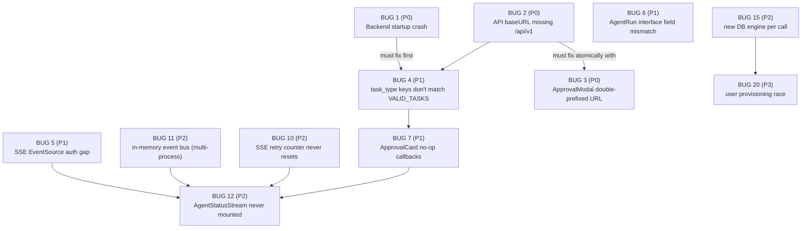

## Plan Comparison (Multi-Model Summary)

Three models analyzed the codebase. All agreed on the 24 confirmed bugs and their priority tiers. Key divergences:

| Divergence | Winner / Recommendation |
|---|---|
| BUG 1 root cause | **Plan 2 wins**: `backend/Dockerfile:7` `COPY app/ ./app/` excludes `memory/` package — Docker is the actual P0 trigger, not just a missing file |
| BUG 2 severity | **Plan 2 nuance adopted**: `frontend/.env.local` already has correct `NEXT_PUBLIC_API_URL`, so local dev works; P0 applies to Docker/CI/production |
| BUG 8 severity | **Plan 2 nuance adopted**: In Python 3.12 inside an `async def`, `get_event_loop()` still works; downgraded from crash-level to maintenance-level (P2) |
| BUG 23 (agents.py line 70) | **Plan 2 assessment**: false positive — valid decorator, not corruption |
| BUG 16 (LinkedIn save) | **Plan 2 reveals worse**: `handleSave` shows fake toast with 500ms delay; users are **actively misled** into thinking save succeeded |

---

## Executive Summary

CareerCraft AI is **not production-ready**. Three P0 blockers mean the backend cannot start and every frontend API call is broken in containerized deployment. A cascade of 21 additional bugs across all layers means the core value proposition — AI agents automating job searches — is entirely non-functional end-to-end. No agent run can succeed: the backend crashes, API paths are wrong, task type keys don't match, SSE streaming can't authenticate, and the approval UI does nothing.

---

## Bug Dependency Graph



---

## Phase 0 — Unblock Core Runtime (Fix First — Nothing Works Without These)

### BUG 1 — P0: Backend startup crash — missing `memory.routes` module
- **File**: `backend/app/main.py:13`
- **Code**: `from memory.routes import router as memory_router`
- **Root cause (Docker)**: `backend/Dockerfile:7` only copies `COPY app/ ./app/`, excluding the `backend/memory/` package from the container image
- **Impact**: Backend `ImportError` on startup — 100% downtime in Docker/production
- **Fix**: Either add `COPY memory/ ./memory/` to `backend/Dockerfile` before the `CMD` line, OR restructure to `app.memory.routes` and update the import, OR create the missing stub module if `memory/routes.py` was accidentally deleted
- **Also**: `app.include_router(memory_router)` at `main.py:59` must remain consistent with whichever fix path is chosen

---

### BUG 2 — P0: ALL frontend API calls return 404 (baseURL missing `/api/v1`)
- **File**: `frontend/src/lib/api.ts:5`
- **Code**: `baseURL: process.env.NEXT_PUBLIC_API_URL ?? "http://localhost:8000"`
- **Root cause**: All backend routes are mounted under `/api/v1` prefix (`main.py:51-58`). Fallback lacks this prefix. `apiClient.get("/users/me/stats")` → `http://localhost:8000/users/me/stats` (404 instead of `http://localhost:8000/api/v1/users/me/stats`)
- **Note**: `frontend/.env.local` already has the correct `NEXT_PUBLIC_API_URL=http://localhost:8000/api/v1`, so **local dev currently works**. Docker/production builds without `.env.local` are broken.
- **Impact**: Every dashboard, jobs, leads, email, resume, agents, settings page is blank/broken in production
- **Fix**: Change fallback to `"http://localhost:8000/api/v1"` — must be done atomically with BUG 3

---

### BUG 3 — P0: ApprovalModal URL double-prefixes `/api/v1` after BUG 2 fix
- **File**: `frontend/src/components/agents/ApprovalModal.tsx:23`
- **Code**: `` await apiClient.post(`/api/v1/agents/${runId}/approve`, { approved }); ``
- **Impact**: After fixing BUG 2 (baseURL → `/api/v1`), this becomes `http://localhost:8000/api/v1/api/v1/agents/...` — 404. **Must fix together with BUG 2 atomically**
- **Fix**: Change path to `` `/agents/${runId}/approve` ``

---

## Phase 1 — Restore Core Agent Workflows

### BUG 4 — P1: Agent `task_type` keys never match backend `VALID_TASKS` — 5 of 6 agents return HTTP 400
- **File**: `frontend/src/app/(app)/agents/page.tsx:15-22` + `backend/app/api/v1/agents.py:22`
- **Frontend sends**: `"orchestrator"`, `"resume"`, `"job"`, `"linkedin"`, `"email"`, `"followup"`
- **Backend accepts**: `{"resume_optimize", "job_search", "linkedin_optimize", "email", "interview_prep"}`
- **Impact**: Only `"email"` agent works. All others return HTTP 400. Core agent functionality broken.
- **Fix**: Map frontend keys to backend task types:

  | Frontend `key` | Backend `task_type` |
  |---|---|
  | `"orchestrator"` | needs new backend task OR remove from UI |
  | `"resume"` | `"resume_optimize"` |
  | `"job"` | `"job_search"` |
  | `"linkedin"` | `"linkedin_optimize"` |
  | `"email"` | `"email"` (already correct) |
  | `"followup"` | no equivalent — disable or remove from UI |

  Also: `orchestrator.py:15-21` has no `"orchestrator"` route in `_TASK_ROUTES` — it falls through to `__end__` immediately. Either add orchestrator routing logic or remove the option.

---

### BUG 5 — P1: SSE streaming broken — `EventSource` cannot send `Authorization` headers
- **File**: `frontend/src/lib/sse.ts:14-15`
- **Code**: `` const src = new EventSource(`${apiUrl}/api/v1/agents/${id}/stream`); ``
- **Backend**: `stream_run` at `agents.py:110` requires `get_current_user` dependency which reads `Authorization: Bearer <token>` header
- **Impact**: Every SSE connection returns HTTP 401. No agent status updates, no live progress, no checkpoint events
- **Fix options**: (A) Pass JWT as query param: `?token=<jwt>` and update backend to accept token from query string in the stream endpoint, or (B) Implement a short-lived ticket/token system where the client first `GET /agents/{run_id}/stream-ticket` and uses the ticket in the URL, or (C) Use `fetch()` with `ReadableStream` + `Authorization` header instead of native `EventSource`
- **Recommended**: Option (C) — custom `fetch`-based SSE consumer, avoiding query-string token exposure

---

### BUG 6 — P1: `AgentRun` interface uses `created_at` but backend returns `started_at`
- **File**: `frontend/src/app/(app)/agents/page.tsx:28,151`
- **Interface**: `created_at: string` (line 28) — but code accesses `run.started_at` (line 151)
- **Backend**: `AgentRunResponse` at `agents.py:46` returns `started_at: datetime`, not `created_at`
- **Impact**: Timestamps always show `"—"` in run history. TypeScript doesn't catch it because the access is on a property not declared in the interface (no `noUncheckedIndexedAccess`).
- **Fix**: Update `AgentRun` interface: replace `created_at: string` with `started_at: string`

---

### BUG 7 — P1: `ApprovalCard` on agents page has no-op callbacks — human-in-the-loop broken
- **File**: `frontend/src/app/(app)/agents/page.tsx:155-162`
- **Code**:
  ```typescript
  <ApprovalCard
    onApprove={() => {}}   // does nothing
    onReject={() => {}}    // does nothing
  />
  ```
- **Impact**: Agents that reach `awaiting_approval` status (resume, LinkedIn, email agents) cannot be approved or rejected from the UI. No `run_id` is passed to the card. Human gate is completely non-functional.
- **Fix**: Pass the `run_id` from the awaiting run, and wire callbacks to call `POST /agents/{run_id}/approve`. Better yet, render the existing `AgentStatusStream` + `ApprovalModal` components (see BUG 12).

---

### BUG 8 — P2 (downgraded): `harness.py` uses deprecated `asyncio.get_event_loop()`
- **File**: `backend/app/agents/harness.py:181`
- **Code**: `loop = asyncio.get_event_loop()`
- **Note**: Currently called from within `async def run(...)`, so a running loop exists and this doesn't crash in Python 3.12. However it generates `DeprecationWarning` logs and is wrong by convention.
- **Fix**: Replace with `asyncio.get_running_loop()`

---

## Phase 2 — Restore Streaming and Live Updates

### BUG 10 — P2: SSE retry counter never resets after successful reconnect
- **File**: `frontend/src/lib/sse.ts:33-39`
- **Impact**: After 3 cumulative connection failures (across all reconnect attempts), SSE permanently stops retrying. A flaky network can permanently kill live updates for the session.
- **Fix**: Add `retryRef.current = 0` inside `src.onmessage` handler (on first successful event), or inside `src.onopen`

---

### BUG 12 — P2: `AgentStatusStream` component exists but is never mounted anywhere
- **File**: `frontend/src/components/agents/AgentStatusStream.tsx`
- **Impact**: The component that properly integrates SSE streaming + `ApprovalModal` was built but never imported or used. After triggering a run, no real-time status is ever shown.
- **Fix**: Import and render `AgentStatusStream` in `agents/page.tsx`, passing the `run_id` returned from the `runMutation` response

---

### BUG 11 — P2: In-memory SSE event queues break under multi-worker deployment
- **File**: `backend/app/core/event_bus.py:9`
- **Code**: `_queues: dict[str, asyncio.Queue] = {}`
- **Impact**: With Gunicorn `--workers > 1`, `POST /agents/run` and `GET /{run_id}/stream` may hit different processes. The SSE stream queue in the listening process is empty — no events delivered.
- **Fix**: Replace `asyncio.Queue` with Redis Pub/Sub (`aioredis` `publish`/`subscribe`). Emit publishes to a Redis channel; `stream_events` subscribes to the same channel.

---

## Phase 3 — Backend Stability

### BUG 14 — P2: `interview_prep_agent.py` fragile JSON parsing — uncaught exception crashes run
- **File**: `backend/app/agents/interview_prep_agent.py:52-57`
- **Impact**: Any non-JSON LLM response crashes with `json.JSONDecodeError`. No fallback.
- **Fix**: Wrap `json.loads(raw)` in `try/except json.JSONDecodeError`, return `status="failed"` with descriptive error on parse failure. Also make markdown fence stripping more robust (handle trailing ` ``` `)

---

### BUG 15 — P2: `sync_db.py` creates new DB engine per agent node call — connection pool exhaustion
- **File**: `backend/app/core/sync_db.py:31-32`
- **Impact**: Under any meaningful load (concurrent users, parallel agent nodes), PostgreSQL connection limit is exhausted. Subsequent connections fail.
- **Fix**: Create a module-level `_engine` and `_factory` singleton in `sync_db.py` (initialized once on first call via a lock), reuse across all helper calls. Still call `asyncio.run()` per call, but share the underlying engine.

---

### BUG 20 — P3: `get_current_user` auto-provision race condition
- **File**: `backend/app/api/v1/deps.py:33-44`
- **Impact**: Concurrent first API calls from the same new user can trigger two simultaneous `INSERT INTO users` → unique constraint violation → HTTP 500
- **Fix**: Use `INSERT ... ON CONFLICT DO NOTHING` via SQLAlchemy `insert(...).on_conflict_do_nothing()`, or catch `IntegrityError` and re-query

---

## Phase 4 — Data Correctness / UX Trust

### BUG 13 — P2: Dashboard always shows 3 hardcoded fake job matches
- **File**: `frontend/src/app/(app)/dashboard/page.tsx:28-32`
- **Code**: `const JOBS = [{ company: "Acme Co", ... }, ...]` — never fetched from API
- **Fix**: Fetch from `GET /jobs/applications?status=saved&limit=3` or from a dashboard stats endpoint

---

### BUG 29 — P2: Dashboard has its own hardcoded ApprovalCard (separate from BUG 7)
- **File**: `frontend/src/app/(app)/dashboard/page.tsx:~111-120`
- **Impact**: The dashboard also renders a permanently-visible "Send follow-up to Acme recruiter" approval card that is entirely hardcoded with toast-only callbacks and no API call
- **Fix**: Replace with dynamic query for runs with `awaiting_approval` status or remove entirely

---

### BUG 16 — P2: LinkedIn `EditProfileModal` shows fake "saved" toast — actively misleads user
- **File**: `frontend/src/app/(app)/linkedin/page.tsx` (`handleSave` function)
- **Code**: `handleSave` contains `await new Promise(r => setTimeout(r, 600))` then shows "Connect LinkedIn OAuth to sync" toast — no PATCH API call
- **Impact**: Users believe their edits saved successfully. Data is silently lost.
- **Fix**: Either implement `PATCH /users/me/linkedin-sections` endpoint and call it, or change the modal to clearly indicate "preview only — edits apply after LinkedIn OAuth connection" without the fake save flow

---

### BUG 21 — P3: Email compose creates only local state — drafts lost on refresh
- **File**: `frontend/src/app/(app)/email/page.tsx`
- **Backend endpoint exists**: `POST /email/compose` at `email.py:101`
- **Impact**: Composed emails are lost on page refresh. Backend compose endpoint is dead code.
- **Fix**: Call `POST /email/compose` from the compose form submit handler and invalidate the `email-drafts` query

---

### BUG 17 — P2: Resume cover letter stale closure — `setGenerating(false)` double-fires
- **File**: `frontend/src/app/(app)/resume/page.tsx:~658`
- **Fix**: Replace `if (generating)` closure guard with `useRef<boolean>` for the "in-flight" tracking, or use `clearTimeout` ref to cancel the safety timeout when generation succeeds normally

---

### BUG 19 — P3: Agents page "Context" sidebar always shows hardcoded values
- **File**: `frontend/src/app/(app)/agents/page.tsx:127-134`
- **Fix**: Fetch from `GET /users/me` (for model name) and `GET /rag/documents` (for resume filename) and `GET /users/me/preferences` (for target role)

---

## Phase 5 — Configuration, Routing, and Hygiene

### BUG 22 — P3: Marketing pages blocked for unauthenticated users (middleware missing public routes)
- **File**: `frontend/src/lib/supabase/middleware.ts:4-6`
- **Missing from public list**: `/about`, `/contact`, `/docs`, `/privacy`, `/terms`, `/status`
- **Impact**: Unauthenticated visitors to any marketing page are redirected to `/login`
- **Fix**: Add all marketing routes to `PUBLIC_PREFIXES`

---

### BUG 9 — P2: `supabase/client.ts` returns `null as any` on server — silent NPE risk
- **File**: `frontend/src/lib/supabase/client.ts:4`
- **Fix**: Throw a meaningful error: `throw new Error("createClient() called server-side — use createServerClient() instead")`, or rename to `createBrowserClientSafe()` with explicit documentation

---

### BUG 18 — P3: `.env.example` missing required environment variables
- **File**: `.env.example`
- **Missing variables**:
  - `YOUTUBE_API_KEY` — required by `core/config.py`; interview-prep videos fail without it
  - `INTERNAL_SECRET` — required for `x-internal-secret` header in worker processors
  - `PINCHTAB_TOKEN` — required by `PinchTabClient` (only `PINCHTAB_URL` is documented)
  - `ALLOWED_ORIGINS` — CORS config references it but it's not shown as an option
- **Fix**: Add all missing variables with placeholder values and descriptions

---

### BUG 24 — P3: CORS `ALLOWED_ORIGINS` wildcard throws `RuntimeError` during import
- **File**: `backend/app/main.py:35`
- **Impact**: Developer misconfiguration causes a cryptic `RuntimeError` at import time (not at `uvicorn.run` time), making it harder to diagnose
- **Fix**: Change to a startup event / lifespan guard for more readable errors, or use `ValueError` with a clear message referencing the `.env` variable name

---

### BUG 27 (Inferred) — `model_router.py` `get_llm()` uses sync SQLAlchemy on async session
- **File**: `backend/app/core/model_router.py:38`
- **Code**: `db.query(UserModelSettings)...` — sync ORM API on an `AsyncSession`
- **Impact**: Currently dead code (agents use `_build_llm` directly, not `get_llm`). If activated, raises `AttributeError`. Should be converted to `await db.execute(select(...))` pattern.

---

## Inferred / Needs-Validation Issues

These were surfaced by analysis but require code-level validation before filing as confirmed bugs:

| ID | Area | Description |
|---|---|---|
| INF-1 | Worker | BullMQ job deduplication — repeated submissions may create duplicate agent runs |
| INF-2 | Email | Gmail MCP OAuth token expiry — no re-auth flow; email agents fail silently after token expires |
| INF-3 | LLM output | Other agent JSON parsers likely have same fragility as BUG 14 (resume, linkedin agents) |
| INF-4 | RAG | Unhandled retrieval failures in `rag_service.py` may silently pass empty context to LLM |
| INF-5 | Worker | `INTERNAL_SECRET` shared between backend and worker via env — if not set identically, worker jobs fail with 403 |
| INF-6 | Frontend | TanStack Query cache not invalidated after approval mutations — stale UI even after successful API calls |
| INF-7 | Auth | Supabase SSR + `null as any` pattern (BUG 9) may cause React hydration mismatches on protected routes |
| INF-8 | Infra | PinchTab token logged/exposed risk — verify `PINCHTAB_TOKEN` is never bundled into client-side code |

---

## Testing Gaps (Why These Reached Production)

- No backend startup smoke test for imports/module resolution
- No frontend-backend contract tests for API path prefixes and `task_type` alignment
- No authenticated SSE streaming end-to-end test
- No action-wiring tests for approval modals, compose forms, save flows
- No TypeScript strict-mode schema/interface parity checks against backend response schemas
- No Python 3.12 compatibility CI matrix
- No load/concurrency tests for DB engine lifecycle and user provisioning
- No assertion preventing hardcoded placeholder data from reaching production builds

---

## Recommended Fix Order (Sequenced)

```
Phase 0 (unblock):  BUG 1 → BUG 2 + BUG 3 (atomic)
Phase 1 (agents):   BUG 4 → BUG 6 → BUG 7 → BUG 5
Phase 2 (stream):   BUG 10 → BUG 12 → BUG 11
Phase 3 (backend):  BUG 8 → BUG 14 → BUG 15 → BUG 20 → BUG 27
Phase 4 (data/UX):  BUG 13 → BUG 29 → BUG 16 → BUG 21 → BUG 17 → BUG 19
Phase 5 (config):   BUG 22 → BUG 9 → BUG 18 → BUG 24
```

**Total confirmed**: 24 bugs
**Total inferred (needs validation)**: 8 issues
**Overall platform health**: Not production-ready. Core agent workflows are 0% functional end-to-end.
