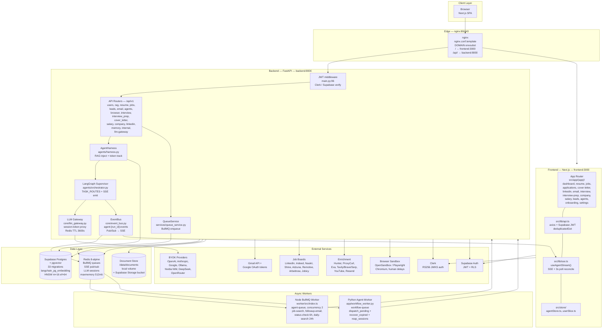
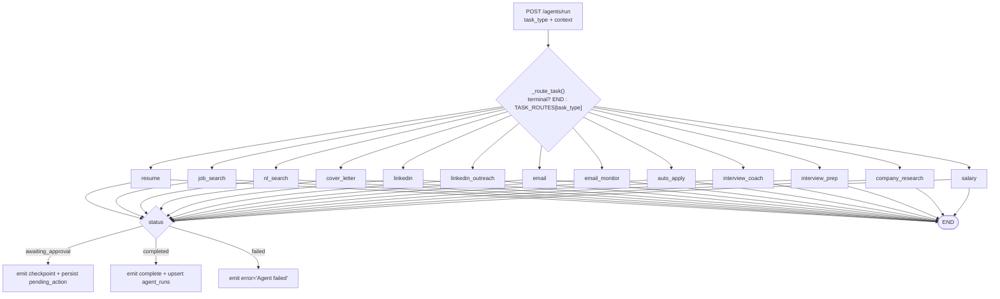
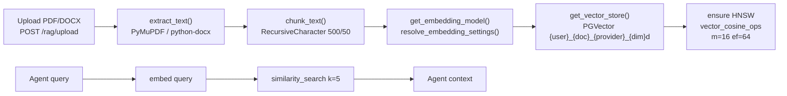
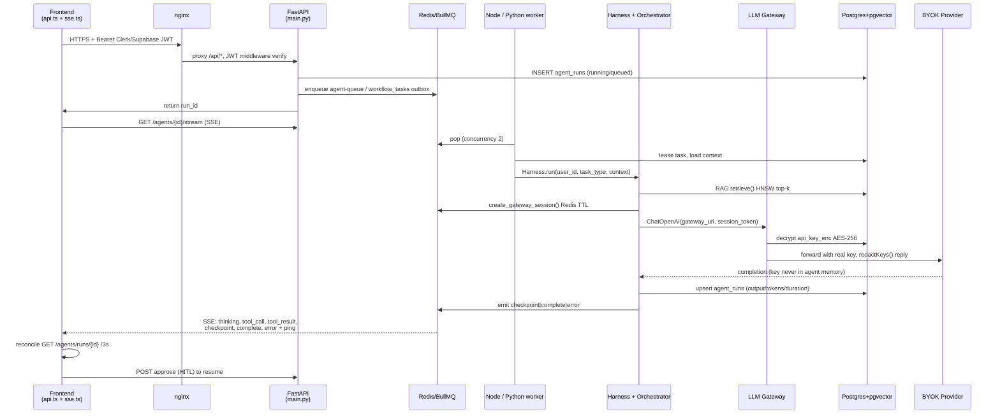

# CareerCraft AI — Complete Architecture

> Verified against codebase: `docker-compose.yml`, `backend/app/main.py`, `backend/app/agents/orchestrator.py`, `backend/app/core/`, `backend/app/services/`, `backend/app/api/v1/`, `worker/src/index.ts`, `frontend/src/`, `supabase/migrations/`, `nginx/`.
> Build status: all 7 phases complete, production-ready. 403 tests collected.

---

## 0. Repository Layout

```
CareerCraft AI/
├── frontend/               # Next.js App Router (port 3000)
│   └── src/
│       ├── app/(app)/      # dashboard, resume, jobs, applications, cover-letter,
│       │                   # linkedin, email, interview, interview-prep, company,
│       │                   # salary, leads, agents, onboarding, settings
│       ├── app/(auth)/ app/(marketing)/
│       ├── components/ lib/ store/  # api.ts, sse.ts, agentStore.ts, userSlice.ts
├── backend/                # FastAPI Python 3.12 (port 8000)
│   └── app/
│       ├── main.py         # app factory, JWT+CORS+request-id middleware, /health
│       ├── api/v1/         # 16 routers + internal.py
│       ├── agents/         # orchestrator + 14 sub-agents + memory/
│       ├── core/           # config, database, redis_client, event_bus,
│       │                   # supabase_auth, security, llm_gateway, model_router,
│       │                   # rate_limit, agent_runs_repository
│       ├── services/       # 30+ services (rag, queue, gmail, exa, browser...)
│       ├── tools/ models/ schemas/
│       └── workflow_worker.py  # Python durable worker (workflow-queue)
├── worker/                 # Node BullMQ worker (agent-queue)
│   └── src/index.ts + processors/
│       ├── job-search.processor.ts
│       ├── followup.processor.ts
│       ├── status-check.processor.ts
│       └── daily-search.processor.ts
├── supabase/migrations/    # 0001..0033 + durable_agent_workflows
├── nginx/                  # nginx.conf.template, nginx-dev.conf.template
├── docker-compose.yml      # frontend, backend, worker, agent-worker, redis, nginx
├── docker-compose.dev.yml / .allinone.yml / .test.yml
└── deploy/ Rat / scripts/
```

---

## 1. System-Level Deployment Diagram



### Docker Compose services (`docker-compose.yml`)

| Service | Build / Image | Ports | Depends | Notes |
|---|---|---|---|---|
| `frontend` | `./frontend` | `3000:3000` | `backend:healthy` | `NEXT_PUBLIC_*` baked as build args; `HOSTNAME=0.0.0.0`; healthcheck on `/` |
| `backend` | `./backend` | `8000:8000` | `redis:healthy` | `mem_limit 2.5g`, `shm 256m` for Chromium; `/health` healthcheck; `browser_debug:/tmp/browser_debug` |
| `worker` | `./worker` | — | `redis:healthy`, `backend:healthy` | Node BullMQ `agent-queue` consumer |
| `agent-worker` | `./backend` `python -m app.workflow_worker` | — | `redis:healthy` | Python durable `workflow-queue` consumer, `mem 2g`, `stop_grace 360s` |
| `redis` | `redis:8-alpine` | `6379` (exposed) | — | `--appendonly yes --maxmemory 512mb --maxmemory-policy noeviction --requirepass` |
| `nginx` | `nginx:alpine` | `80,443` | `frontend:started`, `backend:healthy` | `nginx.conf.template` with `${DOMAIN}` envsubst; `/etc/letsencrypt` mount |

---

## 2. Frontend Architecture

**Stack:** Next.js App Router, TypeScript, Tailwind + shadcn/ui, Zustand 4 (global UI `agentStore.ts`, `userSlice.ts`) + Axios (`lib/api.ts`), SSE hook (`lib/sse.ts`), Motion + Three.js, Sonner toasts, `@supabase/ssr` + Clerk sessions.

**Route groups (`frontend/src/app/`):**

- `(marketing)/` — public landing, pricing, docs, about
- `(auth)/` + `sso-callback/` — login / register
- `(app)/` — authenticated `AppShell` (sidebar + topbar):
  `dashboard, resume, jobs, applications, company, cover-letter, email, interview, interview-prep, leads, linkedin, onboarding, salary, settings, agents`

**HTTP client (`src/lib/api.ts`):**

```ts
API_BASE_URL = NEXT_PUBLIC_API_URL + "/api/v1"
apiClient // axios, 30s timeout, deduplicatedGet() for concurrent GETs
// request interceptor: getSupabaseAuthToken() -> Authorization: Bearer <jwt>
// response interceptor: logs METHOD URL -> status + detail, no auto-redirect loop
apiErrorMessage(err, fallback) // prefers FastAPI `detail`, handles 422 list
```

**Streaming (`src/lib/sse.ts` — `useAgentStream(runId)`):**

1. `POST /agents/run` → `run_id`; `initRun(id)` in store
2. `fetch GET /agents/{id}/stream` with Bearer token → parse `event:` / `data:` frames
3. `addEvent`, `setCheckpoint` on `checkpoint`, `setComplete` on `complete`, `clearCheckpoint` on `approved`
4. DB is authoritative: `GET /agents/runs/{id}` reconcile every 3s (survives refresh / lost SSE)
5. Retry with backoff ×3 on transport failure; `error` event triggers reconcile (broken bus ≠ failed agent)

---

## 3. Backend — FastAPI (`backend/app/main.py`)

**Stack:** FastAPI, Python 3.12, SQLAlchemy 2.0 async, `slowapi` rate limiting, pydantic-settings (`core/config.py`).

**Startup requirements (`main.py:38`):** `APP_SECRET_KEY, DATABASE_URL, SUPABASE_URL, SUPABASE_SERVICE_KEY, SUPABASE_JWT_SECRET, REDIS_URL`. Clerk warns loudly if `CLERK_JWKS_URL`/`CLERK_ISSUER` missing (all authed requests 401).

**Middleware order (execution: CORS → request-id → JWT → route):**

1. `CORSMiddleware` (registered last = outermost; never `*`, exact origins only)
2. `_request_id_middleware` — `X-Request-ID` uuid4 passthrough
3. `_jwt_middleware` — skips `GET /health`, `/docs`, `/openapi.json`, `/internal/*`, `OPTIONS`; requires `Authorization: Bearer`, `verify_token()` → `request.state.user`
4. `slowapi` limiter + generic 500 handler (logs method+path, returns `Internal server error`)

**Lifespan:** checks DB + Redis connectivity, verifies `vector` pg_extension, warms SSE publisher thread (`event_bus._ensure_publisher`), disposes engine on shutdown.

**Health:** `GET /health` (no auth) returns `{status, version, db, redis, pgvector}` — 200 only if all ok else 503.

**Routers (`main.py:206`):**

| Prefix `/api/v1` | Module | Endpoints (representative) |
|---|---|---|
| `/users` | `api/v1/users.py` | `GET /users/me`, `PUT /users/profile`, model-settings CRUD |
| `/rag` | `api/v1/rag.py` | `POST /rag/upload`, `POST /rag/search` |
| `/resume` | `api/v1/resume.py` | `POST /resume/optimize`, `GET /resume/download/{id}` |
| `/jobs` | `api/v1/jobs.py` | `GET /jobs/search`, applications CRUD, `POST /jobs/apply` |
| `/leads` | `api/v1/leads.py` | `GET /leads`, `POST /leads/{id}/action` |
| `/email` | `api/v1/email.py` | `GET /email/threads`, `POST /email/compose`, `POST /email/approve/{id}` (only send path) |
| `/agents` | `api/v1/agents.py` | `POST /agents/run`, `GET /agents/{id}/stream` (SSE), `POST /agents/{id}/approve`, `GET /agents/runs/{id}` |
| `/browser` | `api/v1/browser.py` | sandbox provision / review |
| `/interview` | `api/v1/interview.py` | `POST /interview/session`, `POST /interview/answer` |
| `/interview-prep` | `api/v1/interview_prep.py` | `POST /interview-prep/generate` |
| `/cover-letter` | `api/v1/cover_letter.py` | `POST /cover-letter/generate` |
| `/salary` | `api/v1/salary.py` | `POST /salary/benchmark` |
| `/company` | `api/v1/company.py` | `GET /company/{name}/research` |
| `/linkedin` | `api/v1/linkedin.py` | `POST /linkedin/optimize`, `POST /linkedin/outreach` |
| `/memory` | `memory/routes.py` | semantic memory CRUD |
| `/internal` | `api/internal.py` | worker-only; `schedule_followups()` direct call |
| `/llm-gateway` | `core/llm_gateway.py` | `POST|GET /llm-gateway/v1/{path:path}` proxy |

---

## 4. LangGraph Orchestrator (`backend/app/agents/orchestrator.py`)

Supervisor graph over shared `AgentState`:

```python
class AgentState(TypedDict, total=False):
    user_id: str
    run_id: str
    task: str            # deprecated — use task_type
    task_type: str       # canonical
    status: str          # running, awaiting_approval, completed, failed
    context: dict
    messages: list[dict]
    pending_action: dict | None
    result: dict | None
    error: str | None
```

**Routing table (`TASK_ROUTES`):**

| `task_type` | Graph node | Agent file |
|---|---|---|
| `resume_optimize` | `resume` | `agents/resume_agent.py` |
| `job_search` | `job_search` | `agents/job_search.py` |
| `cover_letter` | `cover_letter` | `agents/cover_letter_agent.py` |
| `linkedin_optimize` | `linkedin` | `agents/linkedin_agent.py` |
| `email` | `email` | `agents/email_agent.py` |
| `interview_coach`, `evaluate_answer` | `interview_coach` | `agents/interview_coach_agent.py` (`_interview_coach_wrapper`: session? evaluate : start) |
| `interview_prep` | `interview_prep` | `agents/interview_prep_agent.py` |
| `company_research` | `company_research` | `agents/company_research_agent.py` |
| `salary_intelligence` | `salary` | `agents/salary_agent.py` |
| `nl_job_search` | `nl_search` | `agents/nl_search_agent.py` |
| `linkedin_outreach` | `linkedin_outreach` | `agents/linkedin_outreach_agent.py` |
| `email_monitor` | `email_monitor` | `agents/email_monitor_agent.py` |
| `auto_apply` | `auto_apply` | `agents/auto_apply_pipeline.py` (`_auto_apply_wrapper`) |

> `follow_up` is **NOT** a graph node — `FollowUpAgent.schedule_followups()` is called directly from `internal.py`.



**Node runner (`_make_node_runner` + `_run_agent_safely`):** emits `log` on start, runs sync fn in thread / async directly, captures tokens via `model_router.get_and_reset_tokens()`, upserts `agent_runs` (status/output/tokens/duration/error) unless durable mode (`context._durable`, worker commits itself), maps terminal status → `checkpoint` / `error` / `complete` SSE.

---

## 5. All Agents — Reference

| Agent | File | Tools / Services | Input → Output | Timeout / Budget |
|---|---|---|---|---|
| **JobSearchAgent** | `agents/job_search.py` | `BrowserUseTool`, `JobPlatformsService`, `IndianPlatformsService`, `RAGService.retrieve()` | `{query, location, salary_min, experience_years, platforms[]} → {jobs[{id,title,company,location,salary,match_score 0-100,url,platform}]}` — keyword+location+experience scoring | 120s / 3000 |
| **ResumeAgent** | `agents/resume_agent.py` | `RAGService.retrieve()`, `ATSService.score()`, `PDFService.generate()` | `{job_description, persona_id?, tone?} → {resume_text, ats_score, ats_suggestions[], document_id, download_url}`; RAG `{user}_resume` + `{user}_achievements` | 60s / 4000 |
| **LinkedInAgent** | `agents/linkedin_agent.py` | `RAGService.retrieve()`, `ProxyCurlService.get_profile()` | target role → `{headline, about, experience_bullets[3]}` suggestions only | 60s / 3000 |
| **CoverLetterAgent** | `agents/cover_letter_agent.py` | `RAGService.retrieve()`, `ThinkingWrapper` (extended thinking) | `{job_description, tone} → {cover_letter, document_id}` | 90s / 6000 |
| **EmailAgent** | `agents/email_agent.py` | `GmailService.get_threads()`, `HunterService.find_email()`, `RAGService.retrieve()` | thread context → recruiter draft; send **only** via `/email/approve/{id}` | 60s / 3000 |
| **FollowUpAgent** | `agents/followup_agent.py` | `QueueService.enqueue()`, `GmailService.get_threads()`, `RAGService.retrieve()` | application → day-5 + day-12 scheduled sends; auto-cancel on reply | 60s / 3000 |
| **EmailMonitorAgent** | `agents/email_monitor_agent.py` | Gmail poll | BullMQ `status-check` every 6h → threads needing action + draft replies | 60s / 3000 |
| **InterviewCoachAgent** | `agents/interview_coach_agent.py` | live session graph | `POST /interview/session` start → `POST /interview/answer` loop; scores clarity/relevance/depth 0-10 | 30s/turn / 2000 |
| **InterviewPrepAgent** | `agents/interview_prep_agent.py` | `RAGService.retrieve()`, `EXAService.search()`, `YouTubeService.search()` | role → question bank + study guide (no live session) | 60s / 3000 |
| **CompanyResearchAgent** | `agents/company_research_agent.py` | `EXAService.search()`, `EXAService.get_page()` | company → `{culture, interview_process, financials, recent_news, key_people}`; cached 7d in `company_intel` | 120s / 5000 |
| **SalaryAgent** | `agents/salary_agent.py` | `EXAService.search()`, `ThinkingWrapper` | `{role, location, experience_years, current_salary?, offer_amount?} → {percentiles{p25,p50,p75,p90}, total_comp, negotiation_script, report_id}` | 90s / 6000 |
| **NLSearchAgent** | `agents/nl_search_agent.py` | delegates to JobSearchAgent | `"senior backend at climate startup, remote, $150k+"` → structured query → job search | 60s / 3000 |
| **LinkedInOutreachAgent** | `agents/linkedin_outreach_agent.py` | `LinkedInOutreachService` | company/contact → queued message (`linkedin_outreach_queue`, `pending_approval`) | 60s / 3000 |
| **AutoApplyPipeline** | `agents/auto_apply_pipeline.py` | orchestrates JobSearch+Resume+CoverLetter+ATS+FormFiller+BrowserControl+Applications+FollowUp | 10 steps, **2 mandatory HITL checkpoints** (review resume+CL, review filled form); platforms: LinkedIn Easy Apply, Indeed, Naukri, Shine, Freshersworld, Glassdoor, generic | 300s |
| **RAG Memory** | `agents/memory/`, `services/rag_service.py`, `agents/semantic_memory.py` | `PGVector` (langchain-postgres) | ingest: PDF/DOCX → 500/50 chunks → embeddings → pgvector `{user}_{doc}` | — |

All agents: model resolved from `user_model_settings` via `llm_gateway.py` (never hardcoded); RAG context injected by harness; every LLM call logged to `agent_runs.tokens_used`; max 2 concurrent runs/user.

---

## 6. RAG Pipeline (`backend/app/services/rag_service.py`)



- **Dimensions:** `openai 1536` (`text-embedding-3-small`), `google 768`, `ollama 768` (`nomic-embed-text`); `EMBEDDING_DIMENSIONS` map; provider-namespaced collections prevent dim mismatch on provider switch.
- **Embedding-capable:** `openai, google, openrouter (proxies openai), ollama`. Chat-only providers (anthropic, nvidia_nim, deepseek) fall back to alternate key (`fetch_embedding_capable_settings`) then local Ollama (3s probe → `EmbeddingsUnavailable` instead of 120s hang).
- **Doc types:** `resume, achievements, certifications, portfolio, notes`.
- **Fallback:** resume retrieval failure → `fetch_user_profile_text()` raw-resume `Document`.

---

## 7. LLM Gateway — BYOK Proxy (`backend/app/core/llm_gateway.py`)

Agents never see real keys:

```
Agent → ChatOpenAI(base_url=LLM_GATEWAY_URL, api_key=session_token)
     → Gateway proxy_llm_request (/llm-gateway/v1/{path})
     → Redis lookup session → decrypt api_key_enc (AES-256, APP_SECRET_KEY)
     → forward to provider (OpenAI Bearer / Anthropic x-api-key)
     → redact_keys() response → return
```

- `create_gateway_session(user_id, model_settings)` — HMAC-SHA256(`APP_SECRET_KEY`) token (48ch + nonce), Redis `llm_gw:session:{token}` JSON `{user_id, provider, model_name, api_key_enc}`, TTL 3600s, cross-worker visible.
- `get_gateway_llm(user_id, db)` — loads active `UserModelSettings`, returns key-free `ChatOpenAI`.
- Provider URLs: `openai, anthropic, google (generativelanguage), nvidia_nim (integrate.api.nvidia)`.
- Defense in depth: `llm_proxy_service.redact_keys()` strips key echoes.

**Model router (`core/model_router.py`):** provider-agnostic `BaseChatModel` + per-user `token_budget` + `get_and_reset_tokens()` accounting.

---

## 8. Queues & Workers

### Node BullMQ worker (`worker/src/index.ts`)

- `Queue("agent-queue")`, `Worker` concurrency 2, limiter 10/min, `removeOnComplete 1000 / OnFail 5000`.
- Dispatch: `job-search → processJobSearch`, `followup-email → processFollowupEmail`, `status-check → processStatusCheck`, `daily-search → processDailySearch`; unknown → throw.
- Schedulers: `status-check-scheduler` every 6h (`{user_id:"all"}`), `daily-search-scheduler` every 24h.
- Fails fast if Redis unreachable (`probe.ping()`).

### Python durable worker (`backend/app/workflow_worker.py`)

`python -m app.workflow_worker` — scales independently:

```
loop every WORKFLOW_DISPATCH_INTERVAL_S (3s):
  recover_expired_tasks()   # re-queue leases past lease_until
  dispatch_pending(queue)   # BullMQ WORKFLOW_QUEUE (default "workflow-queue")
  reap_sessions()           # expire browser sandboxes (SANDBOX_TTL 1800s)
+ BullMQ Worker.execute_task(task_id), lockDuration 60s, concurrency WORKFLOW_WORKER_CONCURRENCY (2)
```

Each step try/except-isolated so queue outage can't starve recovery/reaper.

### Enqueue path (`services/queue_service.py`)

`enqueue_job_search(...)` → deterministic `jobId = sha256(user:query:loc:max)[:16]` (duplicate clicks don't double-run), `attempts 3, backoff exponential 5s`. No `bullmq` installed or Redis down in `development` → inline fallback `_run_job_search_inline` (direct `Harness.run` + persist matches score≥50 to `job_applications`); production raises `Queue unavailable`.

---

## 9. Real-Time Event Bus (`backend/app/core/event_bus.py` + `services/sse_service.py`)

- Channels: `agent:{run_id}:events` (SSE), `agent:{run_id}:queue` (trigger). Publisher: dedicated daemon thread + loop (`_ensure_publisher`, warmed at startup); `publish()` is thread-safe via `run_coroutine_threadsafe`; 2s publish timeout, drops with warning if not ready.
- `emit(run_id, type, data)` — suppressed for terminal events under durable mode (`suppress_terminal_events`, worker publishes post-commit).
- `stream_events(run_id, 300s)` — subscribes, yields `event: {type}\ndata: {json}\n\n`, 5s `ping` keepalive, ends on `complete`/`error`; Redis error → single `event: error {"message":"event bus unavailable"}` (never SSE 500).
- **Events:** `thinking {step,message}`, `tool_call {tool,input}`, `tool_result {tool,output}`, `checkpoint {action_type,details}`, `complete {result}`, `error {message}`.

---

## 10. Data Layer

### Postgres (`backend/app/models/db.py`, `supabase/migrations/0001-0033`)

| Table | Key columns |
|---|---|
| `users` | `id, email, supabase_uid, google_id, linkedin_url, *_enc tokens, auto_mode (drafts|auto), onboarding_completed` |
| `user_model_settings` | `user_id, provider, api_key_enc (AES-256), model_name, ollama_url, is_active, token_budget` |
| `user_documents` | `user_id, doc_type, filename, storage_path (/data/documents), raw_text, embedded_at, is_primary, ats_score, ats_data` |
| `job_applications` | `user_id, company, role, location, job_url, jd_text, match_score, resume_id, cover_letter(_id), status, applied_at, followup_day5/12` |
| `leads` | `user_id, name, email, company, linkedin_url, status (cold...), last_contact` |
| `agent_runs` | `id, user_id, agent_type, status (running|queued|awaiting_approval|completed|failed|error), input/output JSONB, tokens_used, duration_ms` |
| `cover_letter_versions` | `user_id, job_application_id, document_id, tone, version_number` |
| `workflow_tasks` | `run_id, user_id, kind, payload JSONB, status (pending...), available_at, lease_until, error` — transactional outbox, never Data-API exposed |
| `browser_sessions` | `run_id (unique), user_id, sandbox_id, status, expires_at, review JSONB` |
| `browser_account_states` | `user_id PK, state_enc, updated_at` |
| `interview_sessions` | `user_id, job_application_id?, role, company, questions/answers/scores JSONB, overall_score, status` |
| `salary_reports` | `user_id, role, company, location, p25/p50/p75, offer_amount, classification, negotiation_script, data_sources` |
| `company_intel` | `user_id, company_name, overview, culture_summary, news_items, tech_stack, glassdoor_sentiment` (7-day cache) |
| `resume_personas` | `user_id, name, description, primary_resume_id, target_keywords` |
| `linkedin_outreach_queue` | `user_id, company, contact_name/title/url, message, status (pending_approval), approved_at, sent_at` |
| `ats_scores` | `user_id, resume_id?, job_application_id?, composite/keyword/readability/format, missing_keywords, suggestions` |
| `user_preferences` | `user_id (unique), experience_level, years_experience, job_type, work_mode, salary_min/max, target_roles, preferred_locations, prefer_live_browser` |
| `langchain_pg_embedding` | pgvector store + `idx_langchain_embedding_hnsw` |

RLS on all user tables (`user_id = auth.uid()` / `supabase_uid()` fixes in `0018,0023,0024,0028,0030,0032`); pgvector HNSW fixes in `0007,0025,0032`.

### Redis (`redis:8-alpine`)

BullMQ payloads, `agent:{run}:events/queue` pub/sub, `llm_gw:session:*` (TTL 3600), rate-limit counters, `cache:{hash}` (1h).

### Document storage

Local disk `DOCUMENT_STORAGE_DIR=/data/documents` (Docker named volume shared backend+agent-worker — back it up); `SUPABASE_STORAGE_BUCKET=documents` legacy/fallback.

---

## 11. Request Lifecycle



---

## 12. End-to-End Flows

**Auto-Apply (10 steps):** click → `POST /agents/run {auto_apply, job_url}` → `agent_run` + SSE → `JobSearchAgent.get_job_details` (Playwright) → `ResumeAgent.tailor` + PDF → `CoverLetterAgent.generate` → `ATSService.score` → **HITL#1** (resume+CL review) → `FormFillerService.fill` (BrowserUse) → **HITL#2** (form review) → `BrowserControlService.submit` → `ApplicationsService.create` → `FollowUpAgent.schedule` (day-5/12 BullMQ) → `complete`.

**Job search:** `POST /jobs/search` → deterministic BullMQ `jobId` → Node `processJobSearch` (or dev inline) → waterfall Remotive/Arbeitnow/Jobicy/JobSpy or live Chromium if `prefer_live_browser` → score → persist `match_score≥50` → `complete {matches[]}`.

**Email:** `GET /email/threads` (Gmail) → `EmailAgent` draft (Hunter + RAG) → `checkpoint` → `ApprovalModal` → `POST /email/approve/{id}` (sole send path) → Resend/Gmail send → `FollowUpAgent` scheduled; `EmailMonitorAgent` (6h `status-check`) drafts replies to recruiter responses (HITL before any reply).

---

## 13. Security & Guardrails

- **HITL gates (mandatory, non-bypassable):** every email send, job application submit, LinkedIn outreach, and both AutoApply checkpoints emit `checkpoint` + `awaiting_approval`; Browser/LinkedIn automation uses human-like delays (`BROWSER_DELAY_*_MS`); ToS warning for LinkedIn/Naukri automation.
- **Secrets:** `api_key_enc`, `linkedin_*_enc`, `google_*_token_enc`, `state_enc` all AES-256 (`security.py`, `APP_SECRET_KEY`); plaintext never in `user_model_settings`; gateway session-token pattern (above).
- **Isolation:** RLS everywhere; JWT verified per-request (Clerk RS256 JWKS or Supabase HS256); `agent_runs` audit of every run (input/output/tokens/duration); client only ever sees `"Agent failed"`.
- **Transport/limits:** TLS via nginx + HSTS; exact-origin CORS; SlowAPI (`60/min` default, `10/min` agent-run, `5/min` upload, `100/min` strict); 2 concurrent runs/user; token budgets per agent (table §5, overridable `user_model_settings.token_budget`); timeouts per agent (table §5).
- **Infra:** `/internal/*` blocked at nginx (worker via `localhost`); browser `mem 2.5g/shm 256m`, session caps (`BROWSER_USE_MAX_CONCURRENT_SESSIONS=4`, `SANDBOX_MAX_ACTIVE=4`, TTL 1800s, domain allowlist); Bandit SAST on CI.

---

## 14. External Integrations

| Service | Used by | Auth |
|---|---|---|
| Hunter.io | EmailAgent, leads — recruiter email discovery | `HUNTER_API_KEY` |
| ProxyCurl | LinkedInAgent — profile data | `PROXYCURL_API_KEY` |
| Exa (+Tavily/Brave/Serp/Bing/Google CSE/DuckDuckGo/Mojeek/SearXNG) | CompanyResearch, Salary, InterviewPrep, job search waterfall | `EXA_API_KEY`, etc. |
| Adzuna + RapidAPI | JobSearch waterfall | `ADZUNA_APP_ID/KEY`, `RAPIDAPI_KEY` |
| Gmail API / Google OAuth | EmailAgent, EmailMonitor, Drive | `GOOGLE_OAUTH_CLIENT_ID/SECRET`, per-user tokens |
| Resend | transactional email | `RESEND_API_KEY` |
| YouTube | InterviewPrep videos | `YOUTUBE_API_KEY` (optional) |
| Playwright / BrowserUse / OpenSandbox / AgentQL / Firecrawl | AutoApply, JobSearch, FormFiller, BrowserControl | `OPEN_SANDBOX_*`, `AGENTQL_API_KEY`, `FIRECRAWL_API_KEY`; Ollama controller (`BROWSER_USE_OLLAMA_URL/MODEL`) |
| Clerk + Supabase Auth/Storage | identity, JWT, RLS, docs bucket | `CLERK_*`, `SUPABASE_*`, `SUPABASE_JWT_SECRET` |

---

## 15. Configuration (`backend/app/core/config.py`)

Required: `APP_SECRET_KEY, DATABASE_URL, SUPABASE_URL, SUPABASE_SERVICE_KEY, SUPABASE_JWT_SECRET, REDIS_URL`. Auth: `CLERK_JWKS_URL/ISSUER/SECRET/AUDIENCE`. App: `APP_ENV, LOG_LEVEL, FRONTEND_URL, CORS_ORIGINS, NEXT_PUBLIC_*`. Queues: `WORKFLOW_QUEUE=workflow-queue, WORKFLOW_WORKER_CONCURRENCY=2, WORKFLOW_DISPATCH_INTERVAL_S=3, WORKFLOW_TASK_TIMEOUT_S=300`. Browser: `BROWSER_USE_*`, `SANDBOX_*`, `OPEN_SANDBOX_*`. RAG: `RAG_CHUNK_SIZE=500, RAG_CHUNK_OVERLAP=50, RAG_TOP_K=5`. Limits: `RATE_LIMIT_*`, `AGENT_*`. Storage: `SUPABASE_STORAGE_BUCKET=documents, DOCUMENT_STORAGE_DIR=/data/documents`. All external keys optional.

---

## 16. Temporal (feature-flagged durable Auto Apply)

**Status: opt-in, off by default.** `TEMPORAL_ENABLED=false` (see `backend/app/core/config.py`) keeps every request on the existing BullMQ/`WorkflowTask` path — nothing changes until an operator explicitly turns this on. Never remove the BullMQ path while this flag exists; see ADR below.

**Component diagram:**
```
Next.js ──▶ FastAPI (jobs.py, agents.py)
              │  TEMPORAL_ENABLED=false          TEMPORAL_ENABLED=true
              ├──▶ WorkflowTask + BullMQ ─────▶  workflow_worker.py
              │      (workflow_service.py)         (execute_task/dispatch_pending)
              └──▶ Temporal Client ───────────▶  Temporal Server ──▶ temporal_worker.py
                     (start_workflow/signal)        (self-hosted dev, or                (AutoApplyWorkflow +
                                                      Temporal Cloud in prod)             activities.py)
```
Both paths call the **same** `application_workflow.run_application_stage()` — there is exactly one implementation that drives a browser through an application form. Temporal only replaces *orchestration* (retries, waits, signals), never the browser automation itself.

**Auto Apply workflow sequence** (`backend/app/workflows/auto_apply.py`):
```
POST /jobs/applications/{id}/prepare-apply
  └─▶ start_workflow(AutoApplyWorkflow, id="auto-apply/{user_id}/{job_application_id}")
        └─▶ activity: reserve_application_attempt   (ApplicationAttempt + AgentRun, idempotent on run_id)
        └─▶ loop: activity run_application_stage_activity (browser_prepare → browser_input → browser_review)
              ├─ application_answers_required → wait signal `provide_answers` → activity apply_answers_and_resume_activity
              ├─ browser_review / browser_input → wait signal `approve` (same signal — see comment in auto_apply.py)
              └─ browser_review approved → activity run_application_stage_activity (max_attempts=1) → submit
        └─▶ activity: schedule_followup_activity   (only after a confirmed "submitted" outcome)
  Signals: approve, cancel, provide_answers(dict)   Query: status() -> state/pending_action/result/error
```

**Temporal vs BullMQ responsibilities:**

| Concern | BullMQ path (default) | Temporal path (opt-in) |
|---|---|---|
| Retry/backoff | `WorkflowTask.status` + `recover_expired_tasks()` polling | Per-activity `RetryPolicy` |
| Durable wait (approval) | Row stays `awaiting_approval`; resumed by `/agents/{id}/approve` calling `add_task` | `workflow.wait_condition()` on a signal |
| Idempotent submission | `ApplicationAttempt` + `claim_attempt_for_submit()` compare-and-swap | Same `ApplicationAttempt` table + same compare-and-swap (shared code) |
| Worker crash recovery | `recover_expired_tasks()` marks `outcome_unknown` | Temporal replays workflow history from its own event log |
| Observability | `AgentRun` polling + Redis SSE | Same `AgentRun`/SSE (written by the activity wrapper) **+** Temporal Web UI / `tctl` |

**Retry and idempotency policy:** preparation activities retry with bounded exponential backoff (`_PREP_RETRY_POLICY`, max 5 attempts). The one activity call that can reach the actual Submit click uses `maximum_attempts=1` (`_SUBMIT_RETRY_POLICY`) — an ambiguous outcome becomes workflow state `needs_verification`, never an automatic retry. `reserve_application_attempt`'s `run_id` is generated once via `workflow.uuid4()` (deterministic, replay-safe) and passed as activity input rather than generated inside the activity, so an at-least-once retry reuses the same `AgentRun` row instead of orphaning a new one.

**Deployment topology:** local development can opt into a self-hosted Temporal
server with the `temporal` profile. The worker is an independent
`temporal-worker` profile, so production can run it against Temporal Cloud
without starting local Temporal or its Postgres. Host-run development uses
`TEMPORAL_ADDRESS=localhost:7233`; containers use
`TEMPORAL_ADDRESS_DOCKER=temporal:7233` by default. Set the latter to the
managed Temporal address when Compose runs against Temporal Cloud, with the
`TEMPORAL_TLS_*` settings for mTLS.

**Local development:**
```bash
cd backend && pip install -r requirements.txt   # installs temporalio
# In backend/.env: TEMPORAL_ENABLED=true, TEMPORAL_ADDRESS=localhost:7233
# Compose containers use TEMPORAL_ADDRESS_DOCKER=temporal:7233.
docker compose --profile temporal --profile temporal-worker up -d
# Or run the worker on the host after starting the `temporal` profile:
python -m app.temporal_worker
uvicorn app.main:app --reload --port 8000
```
`/health` reports `temporal: {enabled, connected}` separately from the overall status — a Temporal outage or `TEMPORAL_ENABLED=false` never makes the API unavailable.

**Migration and rollback:** rollback is just setting `TEMPORAL_ENABLED=false` — no data migration needed, since `ApplicationAttempt`/`AgentRun` rows are the same tables either engine writes to (Temporal rows additionally carry `workflow_id`/`temporal_run_id`, both `NULL` for BullMQ-driven rows). Migration order per the original design doc: (1) this foundation + a pilot workflow, (2) enable for a small percentage of users, (3) once Auto Apply has run stably on Temporal, retire the BullMQ path as its own separate, later change — never in the same change that introduces Temporal.

**Why Kafka is still not introduced:** unchanged from the original architecture decision — current workloads are commands and moderate-volume domain events, not high-throughput streaming. A Postgres outbox + Redis pub/sub remains sufficient; see the project's architecture notes for the full reasoning and the criteria that would justify revisiting it.

### ADR: Temporal is additive, BullMQ is not removed

**Decision:** Temporal is introduced as a parallel, feature-flagged execution path for Auto Apply. The existing BullMQ/`WorkflowTask` engine (`workflow_service.py`, `workflow_worker.py`) is not modified to be Temporal-aware and is not scheduled for removal by this change.

**Rationale:** BullMQ currently drives more than Auto Apply — job-search queueing, follow-up scheduling, and every other agent's checkpoint/approval loop. Removing it in the same change that introduces an unproven-in-this-codebase distributed workflow engine would mean deleting the working safety net at the same moment as adding the new system, with no fallback if something is wrong.

**Consequences:** two orchestration engines exist side by side until Auto Apply has run stably on Temporal for a meaningful period, at which point retiring BullMQ (for Auto Apply specifically; other BullMQ uses are unaffected) becomes its own separate, well-scoped change.

---

## 17. File Map (where to look)

- Entry: `backend/app/main.py`, `frontend/src/app/`, `worker/src/index.ts`, `backend/app/workflow_worker.py`, `backend/app/temporal_worker.py` (feature-flagged, see §16)
- Temporal (feature-flagged): `backend/app/workflows/{auto_apply,activities}.py`, `backend/app/core/temporal_client.py`
- Orchestration: `backend/app/agents/orchestrator.py`, `harness.py`, `state.py`, `strategies.py`, `base_agent.py`
- Agents: `backend/app/agents/*.py` (see §5 table)
- API: `backend/app/api/v1/*.py`, `backend/app/api/internal.py`
- Core: `backend/app/core/{config,database,redis_client,event_bus,supabase_auth,security,llm_gateway,model_router,rate_limit,agent_runs_repository}.py`
- Services: `backend/app/services/{rag_service,queue_service,workflow_service,sse_service,llm_gateway,llm_proxy_service,job_search_service,job_platforms_service,indian_platforms_service,naukri_service,company_careers_service,gmail_service,resend_service,hunter_service,email_finder_service,proxycurl_service,exa_service,youtube_service,ats_service,pdf_service,persona_service,browser_control_service,form_filler_service,sandbox_service,storage_service,drive_service,google_oauth_service,application_workflow,auto_apply_service,linkedin_outreach_service,token_budget_service,model_catalog_service,search_presets}.py`
- Frontend: `frontend/src/lib/{api,sse,supabase-token}.ts`, `frontend/src/store/agentStore.ts`
- Data: `backend/app/models/db.py`, `supabase/migrations/`
- Infra: `docker-compose*.yml`, `Dockerfile*`, `nginx/*.template`, `deploy/`
