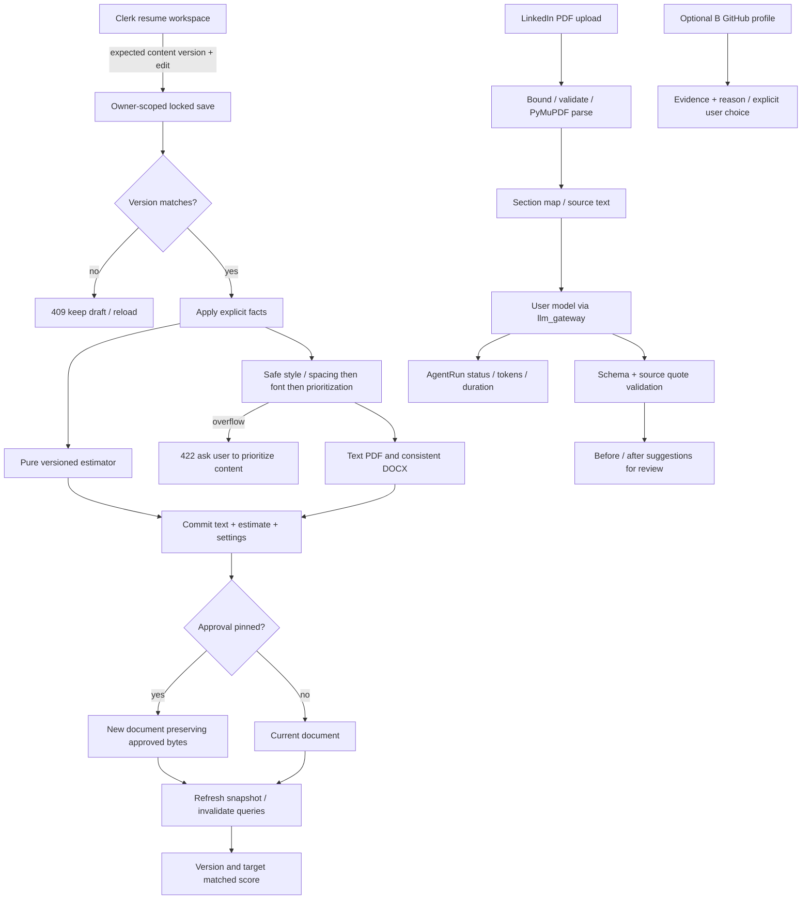

# Agent A: resume and LinkedIn delivery plan

Baseline: `093ef54`; isolated worktree `D:/CareerCraft-agent-a`, branch `agent-a/resume`. Read CLAUDE.md and AGENTS.md before investigation. Existing uncommitted redesign edits in the main worktree are not included or modified. Scope excludes jobs, extension, sandbox removal, GitHub implementation and LinkedIn outreach.

## Phase gates

1. Plan: this document contains the traced flows, explicit contracts, source limitations and acceptance criteria. No implementation before this gate.
2. Implement: bug reproduction first; versioned saves and regression checks; estimator; consistent exports; uploaded LinkedIn analysis; optional GitHub consumption. Each step receives targeted tests and lint and a logical commit. Exit requires all planned steps and backend/frontend tests, lint, typecheck and build.
3. Review: inspect `git diff master...agent-a/resume`; fix defects only, record evidence in REVIEW.md. Real authenticated runs, concurrency, exports, upload/security cases, audits, e2e and migration verification. An unavailable service or credential is a material unverified gate, never a passing check.

## 1. Edit persistence and stale score

### Current behavior and root causes

`frontend/src/app/(app)/resume/page.tsx` owns editor state, explicit Save changes, TanStack mutations and a document generation counter. `frontend/src/lib/resume-api.ts` already POSTs to `/resume/tailored/{id}/fix`. `ResumeFixPanel.tsx` uses the same endpoint for structured corrections. There is no missing save mutation or debounce: saves are explicit and editing is read-only while pending.

`backend/app/api/v1/resume.py::fix_tailored_resume` locks an owner-scoped `UserDocument`, applies facts, renders/uploads a PDF, recomputes only when `ats_data.jd_text` exists, commits and deletes the superseded file after commit. An application-pinned document is copied, preserving the approval's bytes. `services/resume_structure.py` owns parsing and patches; `services/resume_facts.py` remembers user-entered facts. `models/db.py::UserDocument` persists `raw_text`, `ats_score` and JSONB `ats_data`.

The score panel is tied to the primary uploaded document, while the editable preview is a different tailored document. Job analysis is cached in local state keyed by document ID and JD text, not content. Saves update preview state but do not invalidate score/doc queries. `/resume/ats-score` excludes tailored documents and rejects an empty JD through the underlying scorer. Missing saved JD leaves the previous score unchanged. Saved keyword matches are not refreshed with missing keywords. Row locking serializes writes but cannot detect an outdated full-text replacement from another tab. No content version identifies persisted scores. Upload baseline scoring in `api/v1/rag.py` can depend on saved jobs and is asynchronous; this track will not modify the job workflow.

### Target and data model

Reuse UserDocument and its JSONB metadata. A content version is SHA-256 of exact stored UTF-8 markdown. `revision` is metadata incremented only for changed content; legacy documents default to 1. The response always computes `content_version` from saved text. Metadata `estimate` contains content_version, target_hash (SHA-256 of normalized JD or empty), estimator_version, mode, all sub-scores and explanations. No new history table: this version model detects stale state; historical restoration is outside scope. Existing pinned-document copies retain the old version.

Save accepts `expected_version`; a stale hash fails 409 before render/upload/fact persistence. UI always supplies it. Legacy clients may omit it for compatibility. A successful save atomically persists text, export settings and freshly computed estimate even with no JD. A failed render/score/save keeps the existing document. Do not serve a stored estimate as current unless its identity matches the content and target; legacy GETs can compute a fresh deterministic estimate without a model call.

The score card follows the open tailored document, otherwise the primary upload. Explicit target changes trigger a fresh analysis; general analysis excludes keyword/title weights and renormalizes remaining weights. Query identity includes user, document, content version, normalized target and estimator version. Reject late responses whose document generation or target differs; do not show the prior result while `scoring…`. Saved replies refresh snapshot and invalidate document/score queries. Keep unsaved draft on failure and show reload guidance on 409. No autosave/debounce added.

### Acceptance and risks

Failing backend reproduction: a no-JD edit must replace its old score and return a new version; tailored document scoring must succeed. Frontend reproduction: selecting an edited snapshot must replace primary-upload metrics and stale job results. Regression tests cover reload, no-op edits, missing JD, rapid requests, outdated expected hash, foreign ownership, save failure and pinned copy behavior. Race protection depends on all first-party writers using the expected hash; optional legacy writes are documented compatibility risk.

## 2. ATS methodology and research

Research date: 2026-09-30. Parsing populates fields; employer searches, knockout questions and review filters are distinct from optional matching/ranking products. No source establishes a shared universal numeric ATS score or a score that predicts acceptance. A vendor's advertised AI feature is not evidence that every employer enables it.

| Platform | Publicly documented behavior and scoring classification | Source and verification |
|---|---|---|
| Workday | Recruiting parses applications and supports employer workflows; HiredScore offers optional candidate prioritization/grading. Do not claim a universal numeric resume score. | [Workday HiredScore](https://www.workday.com/en-us/products/hiredscore.html). Initial product URLs returned 404; feature details require follow-up verification before making stronger claims. |
| Greenhouse | Parser fills candidate fields. Images, graphics, tables, headers/footers and complex layouts can fail; its published parser limit is 2.5 MB. Parsing is not a resume score. Optional AI matching must be distinguished from core parsing. | [Unsuccessful resume parse](https://support.greenhouse.io/hc/en-us/articles/200989175-Unsuccessful-resume-parse), fetched successfully; page updated March 2, 2026. |
| Lever | Resume parsing extracts candidate fields from supported text documents; search/filter workflows do not establish a default applicant score. Optional integrations may rank independently. | [Understanding resume parsing](https://help.lever.co/hc/en-us/articles/200873450-Understanding-Resume-Parsing); vendor denied automated access (401), so this session cannot verify current details. |
| Taleo | Oracle documents structured candidate search and configurable prescreening/ACE candidate criteria. Questionnaire/requirement scoring is employer-configured, not a universal resume-format score. | [Oracle Taleo Recruiting guide](https://docs.oracle.com/en/cloud/saas/taleo-enterprise/24b/otrcg/index.html), accessible documentation landing page; exact current chapter not verified. |
| iCIMS | AI product explicitly ranks candidates based on skills and experience and offers talent matching. This is optional ranking alongside the ATS; no fixed numeric formula is disclosed. | [iCIMS AI recruiting software](https://www.icims.com/products/ai-recruiting-software/), fetched during review; explicitly states candidate ranking and recruiter control. |
| SmartRecruiters | Core parsing/filtering is distinct from optional SmartAssistant matching. Do not present optional match scores as universal ATS scores. | [SmartAssistant](https://www.smartrecruiters.com/recruiting-software/smartassistant/); automated access denied (403). Exact score scale not verified. |
| Ashby | AI-assisted review evaluates employer-defined criteria as Meets/Does not Meet with evidence, unknown/skipped outcomes and filters. Recruiter decides advancement. This documented feature is criteria evaluation, not a universal numeric score. | [AI-Assisted Application Review](https://www.ashbyhq.com/product-updates/ai-assisted-application-review), fetched successfully; includes source citations and human decisions. |
| Jobvite | Public AI article describes sorting applicants against qualifications, experience, skills and certifications. It does not disclose a numeric resume score or its formula. Optional AI ranking must not be conflated with parsing. | [AI in recruiting](https://www.jobvite.com/blog/ai-in-recruiting/), fetched successfully. |

These access limitations are open research risks, explicitly recorded rather than invented citations or invented platform algorithms. Implementation does not depend on proprietary vendor formulas. Final documentation must retain this distinction and verification status.

### Deterministic estimator

Extend `backend/app/services/ats_service.py`, the existing shared pure scorer; retain compatibility fields for current clients. `tools/ats_service.py` is a separate legacy implementation; inspect callers and delegate its public API to the shared owner if used. No LLM or remote embedding enters scoring. Label every new presentation **estimated ATS compatibility**; display general versus target-job mode. Score estimates properties of supplied evidence, not eligibility or hiring probability.

One versioned config contains weights: parse-ability 20%, sections 15%, keyword/synonym/semantic match 30%, quantified impact 15%, title/seniority fit 10%, formatting safety 10%. Each sub-score 0–100. General mode excludes match/title and renormalizes 60% applicable weight. Unknown layout evidence is explicitly unknown, never proof of safe original PDF formatting.

Parse-ability checks nonempty text, readable character ratio and contact detection. Sections use actual line headings (plain or markdown), not a word mentioned in prose; summary/experience/education/skills are independently explained. Matching tokenizes complete skill phrases including C++, C#, .NET, SQL, Go and R; excludes recruitment boilerplate; compares weighted required/title/preferred terms and fixed, reviewed aliases (e.g. JS/JavaScript, Postgres/PostgreSQL). Semantic match is explicitly a deterministic alias/concept approximation, not embedding similarity. Document its bounded vocabulary. Sort all outputs and use fixed rounding for repeatability.

Impact counts quantified achievement bullets excluding dates and contact numbers; no requirement to invent metrics. Title fit compares role tokens with experience headings and explicit seniority levels; absence is unknown/unavailable instead of fabricated years. Formatting distinguishes positional heading/contact pipes from actual markdown table separators/HTML tables, images or text-box markers. Do not infer a multi-column PDF from markdown alone. Original PDF inspection evidence can report images/text extraction and layout risks separately.

Payload: label, estimator_version, mode, content_version, target_hash, composite_score, sub_scores `{score, weight, applicable, evidence}`, matched_keywords, missing_keywords, match_method and issues `{code, severity: info|warning|error, section, message, suggestion, keyword?}`. Legacy keyword/readability/format fields remain compatibility adapters; readability is diagnostic, not a proprietary ATS rule. Suggest a section for each missing term and say to add it only if true. Scores invalidate on content/target/algorithm changes.

Acceptance: byte-identical serialized results for identical input; all weights/config in one owner; bounds and no-JD normalization proven; C++/C#/SQL, synonyms, heading/prose distinction, false table positives, dates-as-metrics and empty text covered. No unsupported claim that readability or metrics are vendor ranking criteria.

## 3. Parse-safe builder and exports

### Current gap

`services/pdf_service.py::generate_resume_pdf` already offers modern/classic/technical styles, selectable text, standard fonts and section headings without images/tables. It has Unicode fallback and LayoutError recovery; preserve those tested behaviors. It can overflow arbitrarily, uses split role/date rows and caps some entry parts. `ResumePreview.tsx` is a visual HTML approximation. `tools/pdf_service.py` is legacy. No DOCX export/page target controls exist. python-docx and PyMuPDF already exist in requirements.

### Design

Reuse parser/renderer. Add shared fitted export layout carrying exact retained markdown, template, page target, spacing and body font size plus omitted-content suggestions. Fitting order: original style; reduce vertical gaps/leading within readable bounds; then reduce body font to minimum 10 pt; then return explicit content-prioritization suggestions (older optional bullets/projects first). Never silently remove contact, headings, roles/employers, dates, education credentials or skills. If content still exceeds 1/2 pages, return 422 `page_overflow` with actionable suggestions; user edits/approves prioritization and retries. This preserves facts and handles the irreducible-overflow case honestly. Default 2-page maximum; a short resume need not fill two pages.

PDF and DOCX consume the same selected style and text with standard body paragraphs, plain bullets, headings and contact in document body. DOCX uses python-docx; no tables/images/text boxes/header contact. Use sequential entry text for DOCX and PDF reading order. Persist page target and fitted parameters in ats_data; document content is never truncated to force a fit. PDF page count measured by PyMuPDF. DOCX is reflowable; exact page count varies by Word fonts/rendering, so document this limitation and verify rendered DOCX if a renderer is available. UI controls choose pages and PDF/DOCX; use validated enums. Keep existing templates restricted to safe typography, no arbitrary template HTML.

Acceptance: parameterized round-trip tests across three templates and short/long/boundary text. Generate PDF then extract with PyMuPDF; DOCX re-open with python-docx and inspect XML. Assert section order, contact, employers, dates, skill punctuation and bullets survive. Count PDF pages, minimum font 10 pt, no dropped critical text, no table/image/text-box nodes in DOCX. Long irreducible input fails safely with user guidance; Unicode unsupported glyphs must fail visibly rather than silently drop critical text in fitted exports. Preview identifies final export as authoritative for pagination.

## 4. LinkedIn Save-to-PDF optimization

### Current gap

`frontend/src/app/(app)/linkedin/page.tsx` launches `linkedin_optimize` with target_role. `agents/linkedin_agent.py` uses resume RAG plus thinking and returns headline/about/bullets; there is no uploaded profile, skills before/after mapping or grounding in current sections. `api/v1/linkedin.py` currently contains outreach endpoints; add profile-only routes without touching sending or Agent B's integration code.

### Design and model

UI instructions: **Profile → More → Save to PDF → upload**. Multipart `POST /linkedin/profile/optimize` accepts file and required target_role. Bound uploads at 5 MB, inspect extension/MIME plus `%PDF-` signature, read only limit+1, reject encrypted/malformed/image-only PDFs and >20 pages or >50,000 extracted characters; close all handles. Parse with PyMuPDF off event loop. Map Summary/About, Experience and Top Skills/Skills; use first-page header text for headline only when identifiable. PDF may omit sections: preserve empty values and explain missing source, never fill it with imagined facts. Process text in reading order with side-column-aware section mapping; bounded tests include repeated page labels.

Profile-only service invokes `core/llm_gateway.py::get_gateway_llm` using the authenticated user, with uploaded text passed as untrusted data in a separate human message. No scraping, URL fetching, browser capability or external tools. Require Pydantic structured output with exactly headline, about, experience, skills and concrete `before`, `after`, `reason`, `source_quotes`, `gaps` per section. Before fields come from parser, not model. Verify each source quote is a substring of that section; reject ungrounded outputs. Empty sources yield requests for missing information, not invented credentials. Metrics/employers/dates must be preserved; prompt forbids inventing them. Human remains responsible for reviewing proposed prose.

Reuse AgentRun persistence for status, input metadata (bytes/pages/target length, no PDF/raw profile or secrets), output suggestions, token usage, duration and completion. Persist a running row before model work, then completed/failed even on timeout/validation failure; user-safe typed errors. This flow is advisory only and never applies profile edits. Existing outreach gates remain unchanged.

Acceptance: text PDF maps deterministically; four sections have grounded before/after recommendations; wrong MIME/type, oversized, malformed, encrypted, image-only and too-many-page files return safe errors without calling the model. Model response validation and injection-as-data tested. Owner comes exclusively from Clerk; no caller-supplied user ID or cross-owner profile ID.

## Optional GitHub projects

Frontend queries Agent B's authenticated `GET /integrations/github/profile` only optionally. Zod validates `{skills, top_repos, suggested_projects}` once B documents item shapes. 404 skips silently; transient error is optional state and cannot block resume editing/generation/scoring. Suggestions display repository evidence and a reason; never add a project automatically or treat repo existence as verified personal impact.

## Flow

Commit/copy decision in implementation occurs before actual commit, as the current endpoint does; diagram denotes output branches, not transaction ordering. Render/score/upload failures do not persist a changed snapshot.

## API contracts

All paths under `/api/v1`, require Clerk auth; data queries scoped by current_user.id.

| Method / path | Input | Response / failures |
|---|---|---|
| GET `/resume/tailored/{id}` | owner document ID | Existing snapshot + content_version, revision, page_target, estimate; 404 foreign/missing |
| POST `/resume/tailored/{id}/fix` | Existing fields + expected_version + page_target 1/2 | New saved snapshot, possibly new ID when pinned; 409 stale; 422 empty/overflow; safe render/save errors |
| POST `/resume/ats-score` | document_id optional, jd_text optional | Versioned estimator for resume or resume_tailored; empty JD general mode; 404 absent/foreign |
| GET `/resume/download/{id}` | format=pdf/docx, optional pages=1/2 | Owner scoped binary; same safe fitted content; 422 overflow; legacy PDF compatibility retained |
| POST `/linkedin/profile/optimize` | bounded PDF + target_role (1–200 chars) | run_id, section before/after/gaps, warnings; 413 size; 415 type; 422 unreadable/model output; 400 missing model; 504 timeout |
| GET `/integrations/github/profile` | none; optional B-owned endpoint | Zod-validated optional suggestions; 404 ignored |

## Migrations

No new schema required: reuse UserDocument.ats_data and existing AgentRun and RLS. Content versions derive from stored text, so legacy data requires no destructive backfill. If review proves a DB constraint/column necessary, any migration must use an `a_` filename prefix and paired reversible down SQL; reserve no global migration numbers. Verify existing RLS for user_documents/agent_runs and owner predicates. No migration apply/rollback work is claimed when no migration is introduced.

## File change map

| Ownership | Planned paths |
|---|---|
| Resume contracts and save/score/export | backend/app/api/v1/resume.py; backend/app/services/ats_service.py; backend/app/services/pdf_service.py; new resume export/version helpers only if cohesive ownership requires them |
| Resume agent adapter | backend/app/agents/resume_agent.py; legacy tools/ats_service.py only if consolidation is needed |
| LinkedIn uploaded profile only | backend/app/api/v1/linkedin.py (profile additions); new services/linkedin_profile.py |
| Resume UI/contracts | frontend/src/app/(app)/resume/page.tsx; frontend/src/lib/resume-api.ts; resume-types.ts; resume-insights.ts; new validation/helper module; components/resume/ResumeFixPanel.tsx |
| LinkedIn UI | frontend/src/app/(app)/linkedin/page.tsx; new profile upload component/contract |
| Proof | backend/tests/unit/test_resume_* and test_ats_* and test_linkedin_profile.py; frontend resume/profile .test.mjs; scoped e2e tests |
| Documentation | docs/agent-a/PLAN.md; progress and REVIEW.md |

Shared routing/auth/model/integration infrastructure is consumed, not redesigned. Adding Zod to frontend package metadata is a required validation dependency (not currently installed as a declared dependency); limit metadata edits to that dependency and coordinate with B.

## Risk register and defaults

| Risk | Default / mitigation |
|---|---|
| Main workspace uncommitted UI differs from branch | Base on committed HEAD; preserve all main edits; flag integration reconciliation |
| Unsupported public vendor claims | Keep source/access status explicit; no proprietary or universal formula claim |
| Older edits / cross-tab overwrite | Expected content hash with locked comparison; compatibility omission documented |
| Failed file upload or commit | Reuse existing compensation; delete old file only after commit |
| Pinned application PDF changes | Keep existing copy-on-write behavior; no job/approval scope changes |
| DOCX pages vary by renderer | Same text/styles and readable bounds; exact page count verified only with renderer |
| Unfit content | Explicit 422 and prioritization guidance, no silent critical deletions |
| Unsupported Unicode | Reject unsafe fitted export visibly; preserve legacy tested Unicode fallback |
| Ambiguous LinkedIn sidebar sections | Keep missing/ambiguous fields explicit; fixtures for real exported layout |
| Prompt injection / invented facts | No tool access, separated untrusted text, schema and literal evidence checks, human review |
| BYOK provider gateway compatibility | Exercise configured gateway; unavailable model is an unverified live gate |
| No service credentials locally | Tests can use fakes but report live auth/DB/model/e2e limitations honestly |
| GitHub item shape unknown | Coordinate under Requests to B; optional validated query never blocks |
| Whole-repo pre-existing failures | Record baseline and scope of failures; do not fix B's files |

Open questions with recommended defaults: page count means maximum (default two); prioritization requires explicit user editing (no silent dropping); general score means document-only rather than pooled saved jobs; fixed aliases count as approximate semantic evidence; versioning detects edits rather than offering history restoration; LinkedIn target role is required; raw uploaded PDF is processed ephemerally, suggestions persist only in owner-scoped AgentRun.

## Requests to B

1. Document `GET /integrations/github/profile` item shapes, including repository title, URL, description and project suggestion reason. Recommended arrays of objects, skills strings. 404 disconnected; Clerk-scoped access.
2. Keep jobs/auto-apply using approval-pinned stored PDF bytes. Resume export fitting must not mutate approved bytes or submit anything.
3. Coordinate frontend package-lock additions for Zod and audited transitive updates; do not overwrite this branch's scoped lock changes during integration.
4. Shared `backend/app/core/llm_gateway.py` forwards OpenAI chat requests directly to Anthropic/Google native APIs, omits DeepSeek and Ollama, and does not adapt their response schemas. Local active provider is DeepSeek. Add the provider adapters in the shared gateway and a synchronous entry point usable by existing resume/worker nodes; preserve configured models, encrypted keys and session-only agent credentials. Existing resume generation still uses the baseline model_router path and cannot be declared compliant with the requested gateway-only routing until this shared dependency is resolved.
5. Container pip-audit reports 25 advisory records across 10 inherited packages (some duplicate advisory aliases), including LangChain/LangGraph and markdownify. Coordinate compatible dependency upgrades with jobs/browser-use and test the worker; do not interpret successful application tests as a clean security audit.

Plan gate: internally consistent design complete; vendor access limitations and live validation constraints recorded. Implementation may proceed without claiming research sources that could not be fetched as verified evidence.

## Final review boundary

See REVIEW.md for actual verification and findings. Phase 3 exit is not met; release is no-go pending shared gateway/dependency fixes and live model/browser proof. Frontend audited lock updates include Next.js 16.3.8 and DOMPurify fixes. No migration was needed.

## Shared blocker ownership (2026-10-01)

User authorized Agent A to coordinate and fix shared gateway/dependency blockers on agent-a/resume. Agent A owns core/llm_gateway.py, resume gateway integration, constraints/requirements needed for audited dependencies and their tests. B continues owning jobs, extension and GitHub. No B worktree files will be edited. Reuse model_router provider adapters inside the gateway transport, with session-only credentials exposed to agents; validate gateway requests and configured model identity.
