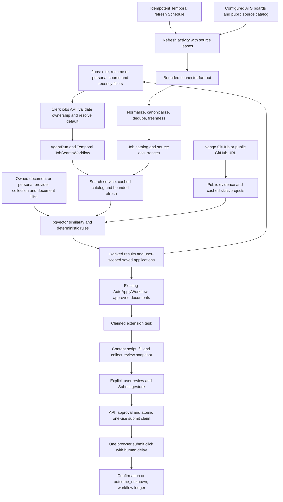

# Agent B: jobs and integrations plan

Date: 2026-09-30. Branch: `agent-b/jobs`. Worktree: `D:/CareerCraft-agent-b`.
Baseline: `093ef54`. Agent A owns resume generation, ATS, builder and LinkedIn PDF.

## Phase status and evidence

Phase 1: complete. Phase 2: in progress, starting with executor retirement and extension security. Phase 3: not started; Phase 2 exit criteria have not been met. Repository instructions in `CLAUDE.md` and `AGENTS.md` were read first. The existing Agent B worktree is reused; the main workspace has unrelated uncommitted changes that must not be copied, reverted or committed here. Existing untracked `docs-sandbox-inventory.tmp` is preserved.

Findings below are from source inspection, not claims of successful live runs. Live provider availability, permissions, Temporal connectivity, migration execution and extension browser reproduction remain Phase 2/3 evidence requirements. In particular, repository documentation's production-ready/test-count claims are not treated as verification.

## Ownership and invariants

- Clerk-authenticated API requests derive the internal user ID from `get_current_user`; never accept it from request bodies. Device APIs use a revocable, user-scoped extension token, not a Clerk JWT.
- Every agent run goes through the existing harness/model gateway and records status, input/output, tokens and duration in `agent_runs`. No connector needs an LLM to fetch or normalize a job. No new model literal.
- Resume selection is validated before enqueueing and again inside the worker. A deleted selection fails clearly; it never silently changes to a different resume.
- One failing source returns partial results plus a sanitized warning. No private credentials, profile text, raw OAuth responses or private repository material in logs.
- Every application submit requires a fresh explicit human approval bound to the task, device, URL and reviewed form. Preparation, navigation, a resume approval, an LLM decision or a reported event is not submit approval. Uncertain external submission outcomes must not be retried automatically.
- LinkedIn/Naukri remain opt-in with human-paced interaction and manual takeover on login/challenges. No CAPTCHA bypass, fingerprint rotation, proxy evasion or robots evasion.
- New user data has ownership queries and RLS; server/system catalog data is not readable by anonymous clients. URLs are untrusted until validated, including redirects and DNS.
- Settings/onboarding get separate components with minimal page imports. Agent A files change only through requests below. Shared models/config/router registration changes are small, scoped hunks.

## Architecture

## 1. Job aggregation

### Current state and root gaps

`backend/app/api/v1/jobs.py` resolves preferences, chooses `_latest_resume_query`, creates an AgentRun and calls `workflows/starters.py:start_job_search`. Its hash omits resume, sources and other search filters; concurrent requests with different bases can reuse the wrong run. A row lock on an empty result does not serialize the first duplicate request.

`backend/app/agents/job_search.py:job_search_agent_node` calls `services/job_search_service.py:search_all_platforms`, scores all candidates in LLM batches, ranks then truncates, and persists high-scoring jobs in `job_applications`. It fetches generic profile text independently of the API's selected resume. Existing ATS fetchers include Greenhouse, Lever, Ashby and SmartRecruiters; open API functions include Remotive, Arbeitnow, Jobicy and optional Adzuna. Reuse these parsers where correct rather than maintaining two implementations.

`job_search_service.py` has callable adapters, normalization, exact-URL dedupe, per-adapter timeout and partial failure handling. Defaults still include JobSpy. Grouped `open_apis`/`ats` adapters overwrite actual origin with the group name. Timeout cancellation of `to_thread` does not stop underlying synchronous HTTP work. `timeout_s` is accepted but unused. There is no durable source catalog, per-source health, independent budgets within a grouped adapter, reliable freshness predicate, cross-source occurrence model or vector-based job ranking. `services/search_presets.py` provides employer/source discovery to inventory and reuse, not a reason to start a new scraper discovery system.

`workflows/scheduled.py` already implements `schedule_specs()` and `ensure_schedules()` with create/update behavior and overlap SKIP. Along with `workflows/job_activities.py`, `services/scheduled_jobs.py` and `temporal_worker.py`, it owns scheduled searches/maintenance. Extend that lifecycle. `frontend/src/app/(app)/jobs/page.tsx` is the Jobs UI entry point; preserve its existing SSE/search results behavior and surrounding style.

### Target design

Extend the search service with a small async connector protocol and registry of concrete connector functions. A source instance is an API plus an employer board/account identifier, not a separate adapter class per employer. Ten implemented connector families and a curated catalog of at least 100 valid public ATS boards provide 10 to 100+ sources without claiming ten API names are 100 sources. Seed catalog entries must include provenance, access posture, last validation and enablement; demonstrate at least ten healthy source instances before shipping. Do not promise every role has a result from every source.

Connector input: validated source configuration, search terms, location, cursor, freshness cutoff and item/page budgets. Output: normalized jobs, next cursor, checked timestamp and sanitized source warning. No browser/LLM dependency for public API connectors. LinkedIn/Naukri legacy adapters remain explicit options, outside the default catalog.

Normalized job: `job_id`, `source_id`, `source_job_id`, `title`, `company`, `location`, `remote` (remote/hybrid/onsite/unknown), `salary_text`, optional structured salary/currency/period, `url`, `platform`, `posted_at` (UTC nullable), `first_seen_at`, `last_seen_at`, `expires_at`, `description` (plain bounded text), and occurrence URLs. Keep legacy response keys so consumers continue working.

Canonicalization removes known tracking parameters/fragments and normalizes host/default ports without lowercasing case-sensitive paths or removing semantic query parameters. Prefer source-native IDs and canonical application URLs. Merge identical canonical URLs; only merge cross-source role/company/location records when evidence identifies the same posting. Do not collapse separate requisitions with the same title. Store all source occurrences so dedupe retains attribution and posted dates. Database uniqueness, not only an in-memory set, makes refresh idempotent.

Freshness default: posted in the last 30 days; UI options 24h/7d/30d/any. Reject expired/closed jobs and future timestamps beyond five minutes of clock skew. Missing dates stay explicitly unknown and are excluded from strict posted-date filters; first-seen is not presented as posted-date. Native API publication/update dates must be distinguished. Retain closed/old records for 90 days for dedupe/history, but do not rank them as active.

Ranking uses pgvector cosine similarity between each job description and the selected resume's document-filtered chunks in its existing provider/dimension collection. Candidate prefilter is bounded by role, location, freshness and source, then vector ranking runs in bounded batches. Reuse embedding configuration in `rag_service.py`; never mix 768/1024/1536 dimensional vectors. Store derived job embeddings by content hash/provider/dimension, under the requesting user's access partition when generated with BYOK. Do not share BYOK paid caches across users. Score: 70% semantic, 20% role/skill overlap, 10% location/work-mode fit, with explicit experience/work-authorization mismatch penalties where facts exist. GitHub public skills provide supporting evidence capped within the skill component, not a replacement resume. Scores are deterministic and clamped 0–100; no fabricated qualifications. Embedding failure returns rule-only results with an explicit warning and ranking mode. Optional existing LLM explanations can only use `llm_gateway.py`, bounded candidates and token logging, and must not be required to show public jobs.

Each source has its own 10-second request timeout, 25-second total refresh budget, two retry attempts for network/429/5xx only, Retry-After handling, page/item/response byte limits, Redis rate key and cache. Start conservatively at one request/second and two concurrent requests per host; source-specific documented limits override that ceiling. Distributed source leases prevent schedule/manual refresh storms. Conditional requests use ETag/Last-Modified where supported. Public-board cache TTL is 15 minutes, negative cache 1 minute; last-good data can be returned for up to 24 hours with stale metadata, never to evade freshness. Cache failures use bounded uncached operation, not unlimited fan-out. Health includes success/failure, latency, last success, next retry, returned counts and rate-limit state; identifiers are logged, not descriptions or secrets.

Use async HTTP calls so cancellation closes requests. Bound global concurrency at eight; drain partial results at the total deadline. The existing `search_all_platforms` interface remains the integration point. Refresh Schedule ID `job-catalog-refresh`, every 30 minutes, overlap SKIP, registered/upserted by existing schedule bootstrap. The workflow delegates network and DB work to activities; activity retries/upserts and lease expiry tolerate at-least-once execution. Deploy versioned workflow changes or drain existing apply/search workflows before incompatible deletions.

### Source access and legal posture

Public accessibility is not permission for unrestricted reuse. No source's commercial redistribution entitlement is assumed. Enable a source only after documenting terms, required attribution, robots/access policy and operator credentials. Honor removals and license restrictions; only fetch published vacancies. The following are conservative implementation defaults, pending current deployment review of linked terms.

| Source | Access and default posture |
|---|---|
| Greenhouse | Official public Job Board API: `developers.greenhouse.io/job-board.html`; configured boards only, preserve employer/application attribution; no candidate/private APIs. Review Greenhouse and board employer terms. |
| Lever | Public postings API: `github.com/lever/postings-api`; employer postings only, official apply link, no protected account scraping; employer terms apply. |
| Ashby | Public job-board API: `developers.ashbyhq.com/docs/public-job-posting-api`; published boards only; no recruiting/private endpoints. |
| Workable | Official API access requires authorized account/token where required; use documented public board endpoint only after confirming permitted access. Disabled without authorized/public access; do not substitute HTML evasion. |
| SmartRecruiters | Official Posting API: `developers.smartrecruiters.com`; public company postings with pagination/attribution and published limits; no candidate account data. |
| Recruitee | Documented public careers offers endpoint on configured employer career sites; verify tenant terms. No recruiting endpoints. Follow-up family after required ten ship. |
| Adzuna | Authorized app ID/key; API agreement, country coverage, attribution and caching/redistribution limits at `developer.adzuna.com`. Disabled without keys; never log keys in query strings. |
| Jooble | Official keyed API at `jooble.org/api/about`; comply with agreement, link-back and quotas; disabled without key. Follow-up family after required ten ship. |
| Remotive | Public API at `remotive.com/api/remote-jobs`; display attribution/link-back and comply with publication delay, cache and redistribution restrictions in its current API documentation; no bypass of delayed listings. |
| RemoteOK | Public feed `remoteok.com/api`; retain feed legal/attribution metadata, verify current reuse terms before enablement, respect caching and throttling. |
| Arbeitnow | Public job-board API documented at `arbeitnow.com/blog/job-board-api`; preserve source links, pagination and published access conditions. |
| JSON-LD/sitemaps | Only configured, permitted public HTTPS employer career URLs; fetch robots.txt for the declared user-agent, honor disallow, sitemap limits and site terms. Structured `JobPosting` availability does not grant reuse rights. Disabled when policy cannot be established. No arbitrary web crawling. |
| LinkedIn/Naukri | Optional user-authorized connectors; ToS may prohibit automation. No default scraping, evasion or challenge-solving; human delays and stop/manual handoff on restriction. Users can open original application links. |

Acceptance: ten required families have fixture and live-or-recorded evidence; 100+ reviewed source configurations can refresh within quotas; one failing source does not break search; correct native badges/dates survive dedupe; recency/source filters work server-side; vector/rule modes are observable; HNSW and pagination work at 100k postings without unbounded per-search LLM calls.

## 2. Search resume selector

### Current state and root gap

`jobs.py:_latest_resume_query` orders owned resume documents by primary/embedded time. `UserDocument` has `doc_type`, `raw_text`, `is_primary`, `embedded_at`; `ResumePersona` lives in `models/db.py`, and persona endpoints are in `api/v1/resume.py`. `UserPreferences` has no selected search basis. Agent scoring calls `core/sync_db.py:fetch_user_profile_text`, ignoring API selection. `rag_service.py:collection_name` uses user/type/provider/dimension; `retrieve` searches the entire collection and its fallback can choose generic profile text. Ingestion supports metadata, so document filtering should extend that mechanism rather than creating incompatible collections.

### Target, data and APIs

Use a discriminated basis `{kind: "resume" | "persona", id: UUID}`. Persist it in a new B-owned `job_search_preferences` row, not in the resume builder's primary-resume setting. Default selection order: explicit override, saved default, owned primary/latest resume. No resume still allows a role-only search with a clear notice. `ResumePersona.primary_resume_id` already provides the nullable backing-document FK: reuse it, with ownership checks on both the persona and document. An unbound persona is shown unavailable until the user binds a resume through A's existing persona flow; never treat its name as resume text. No new persona binding field or migration is needed.

Return options only for the signed-in user: filenames/persona labels, readiness and default. Validate foreign IDs uniformly as 404 to avoid disclosure. Revalidate inside activities, resolve selected text once and pass `basis`/`resume_document_id` through API -> workflow -> harness -> node. Include resolved basis and all effective query filters in the stable search hash. Use Temporal workflow-ID conflict/reuse semantics plus database constraints/advisory serialization for duplicate starts; the current empty-row lock is insufficient.

Selected resume retrieval uses the existing provider collection with metadata `document_id` filter, plus ownership-validated raw-text fallback for that exact document. Existing embeddings need a metadata backfill/re-ingest if their document identifier is missing; never treat missing metadata as all resumes. Persona-specific keywords can supplement its bound resume but cannot reach another user's collection. Broader harness memory cannot overwrite selected basis. Deleted default is cleared on next read; an explicit deleted override returns 404. Search selection does not authorize submitting that resume.

UI: accessible Jobs `JobSearchBasisSelector` component with uploaded resumes/personas, per-search choice and explicit save-default action. Reuse TanStack Query/API client patterns. Loading, empty, unavailable-embedding and error states; clear selected filename near results. Requests and keys include basis/source/recency.

Acceptance: two distinctly different resumes produce different context/ranking; default survives reload; override does not rewrite default; another user's resume/persona is rejected through every API and worker path; deleted/unembedded resumes behave as documented; RAG trace proves the selected document filter and collection namespace; legacy role-only search works.

## 3. Remove OpenSandbox product execution

### Current state and inventory

The application has an extension-default path and a configurable `server_browser` path. OpenSandbox provision/CDP/state handling is in `services/sandbox_service.py`; takeover is `api/v1/browser.py`; application execution is `services/application_workflow.py`; maintenance reaps sessions. Raw case-insensitive inventory is stored next to this plan in `SANDBOX_INVENTORY.txt` and must be regenerated before deletion to catch changes. Also search dependent symbols (`BrowserSession`, `BrowserAccountState`, `server_browser`, browser checkpoint types and `/browser`), not just the literal product name.

| Layer | Confirmed files / dependent paths to inspect |
|---|---|
| UI | `frontend/src/components/agents/BrowserWorkspace.tsx`, `ApprovalModal.tsx`; all Jobs/Agents checkpoint consumers and settings execution-mode controls found by symbol search |
| API | `backend/app/api/v1/browser.py`, registration in `main.py`; checkpoint approval dispatch in `api/v1/agents.py`; resume-delete logic in `api/v1/resume.py` belongs to A |
| Services/agents | `sandbox_service.py`, `application_workflow.py`, `workflow_service.py`, managed branch in `browser_control_service.py`, `scheduled_jobs.py`, `agents/auto_apply_pipeline.py` |
| Workflows | `workflows/auto_apply.py`, `activities.py`, `job_activities.py`, `scheduled.py`, `starters.py`, worker registrations; preserve extension, follow-up and generic search workflows |
| Schema | `models/db.py:BrowserSession`, `BrowserAccountState`; original `supabase/migrations/20260909180254_durable_agent_workflows.sql`; attempt ledger remains |
| Config/deploy | `core/config.py`, `.env.example`, `.github/workflows/ci.yml`, `docker-compose.test.yml`, `sandbox/Dockerfile`, `sandbox/start.sh`, `deploy/oracle-vm/Dockerfile`, `sandbox.toml`, `compose.yml`; inspect all Compose/deploy variants and dependency lockfiles |
| Docs | `docs/CONFIGURATION.md`, `DEPLOYMENT.md`, `ARCHITECTURE.md`, `BROWSER_SCALING_ARCHITECTURE.md`, `AGENTS_TROUBLESHOOTING.md`, `agent-system-technical-spec.md`, root `README.md`; inventory contains exact lines |
| Tests | `tests/integration/test_durable_workflows.py`, `tests/unit/test_workflow_runtime.py`, `test_internal_status_check.py`, `test_temporal_api_integration.py`, `test_temporal_workflows.py`, `test_ats_greenhouse.py`, `test_ats_lever.py`, extension fixtures/test Compose; replace coverage of shared ownership/SSRF/submit invariants before deleting product-only tests. `test_workflow_sandbox.py` and Chromium isolation flags are native security references, retained. |

### Safe deletion design

Extension becomes the only auto-apply executor. Optional legacy browser search/outreach remains subject to existing auth/approval/delay controls and must not acquire OpenSandbox sessions. Delete takeover UI/router, provision/reap/state services, mode config, images/volumes/secrets and obsolete branches. Move shared form snapshot, confirmation constants and attempt-ledger helpers out of `application_workflow.py` to the existing applications responsibility before deleting that service; ATS adapters import its constants, so deleting the file first breaks extension-independent code. Keep ownership and SSRF validation in their actual surviving layers.

Drain or version running server-browser workflows and notify users that pending forms require restarting in their own browser. No live workflow history replay should reference removed activities. Migration adds no destructive drop initially: remove unused tables from application access, revoke runtime access and retain an operator backup. A later reversible schema retirement migration can rename/archive `browser_sessions` and encrypted `browser_account_states`; deleting stored data requires an explicit retention decision and cannot truthfully have a data-preserving down migration. Do not edit applied historical migrations to conceal names. New migration filenames use `b_` and include separately runnable down SQL.

Literal zero occurrences of the English word "sandbox" is incompatible with preserving Temporal's `workflow_sandbox` runner and Chromium flags/security documentation, and with immutable applied migration history and this required inventory. Exit check is zero OpenSandbox product execution/config/deploy references in active code, with historical migrations and native security mechanisms explicitly classified. Never disable Temporal/Chromium isolation to make grep green. The raw grep and classifications are review evidence, not silent exclusions.

Acceptance: no OpenSandbox dependency/route/UI/config/service/container remains; extension and all ATS adapters import/run; compose validates; retired routes return 404; no stranded live workflows or lost attempt ledger; raw inventory classifies every retained historical/native reference. Data cleanup is reversible until an explicitly authorized purge.

## 4. Auto-apply extension

### Current trace and diagnosed gaps

MV3 `extension/manifest.json` points to `src/background.js`. Static job hosts plus optional HTTPS hosts are present; the web-app bridge is static on localhost/production and dynamically registered for paired origins. `src/common.js` handles origin/API mapping and storage; `src/content/bridge.js` bridges the web app. Backend `api/v1/extension.py` pairs browsers through Clerk, while `/extension/device/*` bypasses Clerk middleware and authenticates hashed `ccx_` device tokens through `extension_service.py`. Hash-only server storage is appropriate for opaque tokens; OAuth credentials remain encrypted in Nango. Do not replace token hashes with recoverable encrypted device secrets.

`background.js` polls/claims, opens a tab and injects content scripts. Unknown-host permission failure currently consumes/fails a claimed task. `apiFetch` discards non-JSON error content and message handlers often reduce backend detail to `http_NNN`; most poll errors are console-only. `handleMessage(msg, sender)` does not use the sender to bind privileged plan/event/resume calls to the active task tab. `CC_MARK_SUBMITTING` sets a local boolean, not a server authorization. The API accepts `submitted` terminal events and optional device assignment through `_device_task`; a user-visible review panel alone cannot enforce the backend approval invariant.

`src/content/{dom,drivers,panel,runner}.js` owns extraction, platform selectors, progress, review and submit. DOM shape, SPA navigation, cross-origin frames and renamed submit buttons require fixture reproduction, not guessing new selectors. `extension/test/e2e_live.py` and fixtures are the existing browser test starting point. `common.js:apiBase` sends requests to the paired app origin plus `/api/v1`; verify that origin's Next.js/deployment reverse proxy reaches FastAPI, rather than assuming the extension talks directly to port 8000. Background host permissions allow extension fetches; they do not authorize a server request. FastAPI CORS uses configured origins, credentials and an explicit method/header list: test actual preflight responses and keep the allowlist, never fix pairing with wildcard origins. Pairing/auth, proxy routing, host grants, service-worker restart, each driver and LLM failures must be reproduced separately before attributing the user's failure to one cause.

Fill planning in `extension_service.py` reuses `applications/answer_resolver.py`; saved/profile answers precede bounded generation and sensitive answers stay human-owned. `/device/decide` calls `services/decision_engine.py`, whose deployment-level Jev/Laya path bypasses the user's model gateway. Keep deterministic DOM heuristics where sufficient; any generative fallback must go through user/task-bound gateway and be logged to the owning AgentRun. A DOM decision never authorizes submit.

### Target contract and implementation

Keep existing pair/me/claim/plan/resume contracts compatible. Add validated task-scoped review and approval endpoints. Claim is atomic; only the assigned device can read plans, resume bytes, report progress or request approval. Runtime messages require the actual active tab ID, task ID and a valid supported HTTPS page origin; pair/bridge messages additionally require the configured app origin. Never expose tokens to content scripts or page messages; restrict extension storage access to trusted contexts and invalidate stale pairings visibly.

Review captures sanitized visible fields, current URL, selected document digest and submit control fingerprint. Exclude passwords/hidden fields and cap payload sizes. Backend computes review hash; approval is allowed only for the latest review, matching claimed task/device and explicit user-confirmed intent. Under a transaction lock, move the existing ApplicationAttempt to `submitting` and issue a short-lived single-use capability bound to the hash. The extension performs one submit click only after approval success, and verifies unchanged DOM/URL before that click. A form mutation/navigation requires a new review. Repeated approval returns conflict, not another click permit. Terminal `submitted` events without the capability/claimed state are rejected; confirmation evidence records a verified result or `outcome_unknown`, never blind success.

The gesture is in the extension review panel; content-script messages alone must not mint approvals silently. A trusted extension popup confirmation/request path authorizes the server claim, and the background validates sender/context before forwarding. No bearer scheme can prevent the user from manually clicking a site button or modifying their own extension; the guarantee is that CareerCraft-controlled automation has no ungated submit path. Human delays remain in every LinkedIn/Naukri driver and after approval.

Permission requests occur during a user gesture in popup, scoped to the target origin; do not ask for all hosts. Preserve task/recoverable status while awaiting permission. Treat unknown final buttons, frames and sensitive questions as manual input. A popup status panel surfaces revoked pairing, missing host permission, connectivity, expired task, model configuration, 429/retry and validation details safely. Timeouts and fetch errors must terminate loading states.

Acceptance: pair -> permission -> claim -> fill -> edit -> review -> explicit approval -> one submit -> confirmation works on recorded Greenhouse/Lever/LinkedIn/Naukri flows; direct submitted-event bypass, cross-device task access, stale review, duplicate approval, malicious sender and automatic-submit selectors fail. Worker restarts and lost confirmation do not cause duplicate submissions. Live verification uses a controlled test form, never a real application without approval. Document browser installation and an exact manual script if MV3 test automation is unavailable.

## 5. Optional GitHub through Nango

### Current state and gap

`backend/app/integrations/{gateway,nango,factory,repository,providers,webhooks}.py` already provide Nango sessions, fixed-provider proxying, connection records and signed webhook synchronization. `api/v1/integrations.py` exposes connect/disconnect/status routes; Gmail metadata is encrypted. `providers.py` currently supports Google/Microsoft services, not GitHub. Clerk GitHub login in auth/account pages is identity login, not consent to read repository data. Candidate profile's `github_url` is only a link, not a skills integration.

### Target design, data and APIs

Add `github` to existing provider definitions and `NANGO_PROVIDER_CONFIG_KEYS`. For public repositories, prefer an empty OAuth scope request; do not request `repo` or `public_repo` (both grant write capabilities), org/admin/write scopes or private-repo access. If the chosen Nango template cannot offer public-only OAuth, use the public URL fallback until a minimal template is configured. Nango stores encrypted OAuth tokens; never copy raw credentials into user profile tables. Proxy only fixed `api.github.com` paths and GET methods in the service. List the authenticated user's **public, owned** repositories and verify each repository's visibility before fetching any content. Never send private repo data to embeddings, prompts or logs, even if a mistakenly broad upstream grant exists.

Fetch capped paginated repos (100 max), language statistics, bounded READMEs and recent public activity. Cache profile 24h, honor GitHub Retry-After/X-RateLimit-Reset, conditional requests and maximum content bytes. Activity is evidence of recent work, not a measure of professional competence. On OAuth/provider/parser failure offer a public-profile URL input; do not automatically scrape an unrelated identity. Accept only exact `https://github.com/{username}` syntax without userinfo/query/fragment/custom port; derive fixed `api.github.com/users/{username}/repos` URLs. Public REST API unauthenticated rate limits are lower; a 403/429 shows last good data and retry time, or a recoverable error. Fallback is usable with Nango disabled and no GitHub integration secrets. DNS/redirect protections apply to fetches; never follow README hyperlinks or arbitrary download URLs.

Deterministic evidence analysis: languages by byte share, frameworks from explicit README/package evidence when available, links to public repositories, and timestamps. Skills carry evidence URL and confidence category; "verified" means the cited repository shows that technology, not that proficiency is certified. Ignore instructions embedded in READMEs; no generative model is needed to interpret arbitrary instructions. Forks/archived repos are penalized, empty/no-evidence repos omitted. Rank project suggestions by role/skill relevance, owned contribution evidence, recency and documentation, with deterministic tie-breaking and one reason each. Do not fabricate metrics, job history or project claims. Cap skills at 50 and projects at 10; resume consumption remains optional and user-reviewed.

Persist a B-owned `github_profiles` row keyed by user: connection mode (nango/public_url), public login, sanitized profile JSON, evidence timestamps, refreshed/expires times and last sanitized error. No tokens or private raw responses in this table. Private-source detection is a hard discard. Cache keys include user and connection version. Disconnect revokes Nango and stops all matching immediately; delete-data removes cached profile, derived skills/project embeddings and user-scoped cache keys. Combined disconnect/delete can be retried idempotently; a failed upstream revoke is surfaced rather than claimed successful. Signed late webhooks cannot resurrect a revoked/deleted connection.

Agent A contract is exactly `GET /api/v1/integrations/github/profile` -> `{skills, top_repos, suggested_projects}`. A valid OAuth or public-URL connection counts as connected. Return 404 for absent/disconnected/deleted data, 503 for an unavailable refresh with no valid cache, and 200 with the stable three keys otherwise. Do not convert 404 into a fatal resume-flow error. Nested shapes are locked in the API table. A connected empty public account returns empty arrays, not 404. No implicit connection from a Clerk identity or candidate URL.

Add separate `GitHubIntegrationSection` and `GitHubOnboardingStep` components. Wire them minimally into `frontend/src/app/(app)/settings/integrations/page.tsx` (already renders `components/settings/BrowserExtensionCard.tsx`) and `frontend/src/app/(app)/onboarding/page.tsx` (already uses `components/onboarding/OnboardingStepper.tsx`). Settings shows connect/public URL fallback, refreshing/loading, evidence, disconnect and delete-data actions. Onboarding step is skippable and skip never creates connection data or blocks completion. No redesign. Job matching reads GitHub profile only when opted in/connected; absence/404/temporary failure does not break jobs or resumes.

Acceptance: no OAuth setup still permits public URL fallback and the rest of the app works without either; GET absent is 404, connected empty is 200; user A cannot access B's cache; only public data is fetched; tokens remain in Nango/encrypted metadata; disconnect/delete clears matching and late webhook behavior; fixture tests cover pagination, rate limits, malformed README, injection text, parser failure, evidence reasons and onboarding skip.

## API contract table

All routes below have `/api/v1` prefix. Clerk auth unless marked device. API errors use existing `detail` conventions; no secrets/provider stack traces.

| Method/path | Request | Success and error contract |
|---|---|---|
| GET `/jobs/search-bases` | none | `{options:[{kind,id,label,ready}], default_basis: basis|null}`; owned options only |
| PATCH `/jobs/search-basis` | `{basis: basis|null}` | saved basis; 404 foreign/missing; 422 invalid shape; reuse existing CORS-supported PATCH method |
| GET `/jobs/search/profile` | optional basis query | existing preview plus resolved basis/readiness; same ownership rules |
| POST `/jobs/search` | existing fields plus `basis?`, `sources?:string[]`, `posted_within_days?:1|7|30|null` | existing `{run_id,queue_job_id,status,queued}`; filters/basis in effective idempotency key; no LLM setup required for rule-only public search |
| GET `/jobs/catalog` | role/location/source/recency, opaque cursor, bounded limit | `{jobs,next_cursor,warnings,ranking_mode}`; source badges/date/score keys retained; stable cursor ordering |
| GET `/jobs/sources` | none | enabled source IDs/families, public health/attribution; no keys/account secrets |
| POST `/extension/pair` | `{name}` (Clerk) | existing `{device_id,name,token}` returned once; token hashed in DB |
| POST `/extension/device/tasks/claim` | none (device) | existing task or 204; only assigned device may use claimed task |
| POST `/extension/device/tasks/{id}/review` | sanitized snapshot and URL (device) | `{review_hash,expires_at}`; 409 stale/inactive; 422 unsafe URL/shape |
| POST `/extension/device/tasks/{id}/approve-submit` | `{review_hash,user_confirmed:true}` (trusted extension confirmation + device) | single-use `{submission_token,expires_at}` after atomic claim; 409 repeated/stale/wrong state; bound to device/task/current review |
| POST `/extension/device/tasks/{id}/events` | existing event plus submit capability for terminal submission (device) | existing progress reply; 409 unapproved/stale/duplicate; never directly invents success |
| POST `/integrations/connect-session` | existing `{provider:"github",return_path}` | existing Nango session shape; disabled is 503; fallback remains available |
| POST `/integrations/github/public-profile` | `{url:"https://github.com/login"}` | profile in stable shape below; 422 malformed/non-GitHub; 503 rate/provider unavailable |
| POST `/integrations/github/refresh` | none | refreshed profile; 404 disconnected; 503 unavailable without cache |
| GET `/integrations/github/profile` | none | **`{skills: Skill[], top_repos: Repo[], suggested_projects: Project[]}`**; 404 not connected; optional integration for A |
| DELETE `/integrations/github` | none | extend existing `DELETE /integrations/{provider}`; idempotent disconnected; upstream revoke failures surfaced, local matching disabled |
| DELETE `/integrations/github/data` | none | idempotent 204; profile/evidence/derived caches removed, connection disabled to avoid immediate re-creation |

Stable nested GitHub contract:

- `Skill = {name:string, category:"language"|"framework"|"tool", evidence_urls:string[], confidence:"verified"|"suggested"}`.
- `Repo = {name:string, url:string, description:string|null, languages:string[], updated_at:string|null, score:number, reason:string}`.
- `Project = {name:string, url:string, skills:string[], reason:string}`.
- Arrays are always present; nullable description/date are explicit. No tokens, raw/private code, instructions or invented resume bullets. Datetimes are ISO-8601 UTC.

## Migrations and rollback

Use timestamp-ordered Supabase filenames whose descriptive names are prefixed `b_` (for example `20260930HHMMSS_b_job_catalog.sql`), so existing tooling accepts them. Separate down scripts live under `docs/agent-b/rollback/`, outside the apply directory. Verify ordering against Agent A before allocating timestamps.

| Migration | Changes and down behavior |
|---|---|
| `b_job_catalog` | `job_sources` (configuration/access posture/health, no API keys), `job_postings` (canonical identity/content/freshness), `job_occurrences` (source-native uniqueness/provenance), user/provider/dimension embedding cache. Unique canonical/source IDs, posted/active/source indexes and dimension-compatible HNSW indexes. Catalog writes restricted to worker/system role; user embedding rows have user RLS. Down removes B-only indexes/tables after snapshot; no application ledger deletion. |
| `b_job_search_basis` | `job_search_preferences(user_id PK,resume_document_id nullable FK,persona_id nullable FK)` with exactly-one check, user RLS and ownership checked by API/worker; the API maps these to the discriminated basis. Clear/delete the preference row on selected-document/persona deletion (SET NULL alone would violate exactly-one). Down removes only selector preferences. |
| `b_extension_submit_approval` | Add latest review hash, approval time, bound device, capability hash/expiry to existing task/attempt responsibility; uniqueness/CAS state prevents duplicate click. Never store raw submit secrets. Down only after apply workflows drain; preserve attempt outcome evidence. |
| `b_github_profiles` | Public profile cache with user PK/FK, mode check, JSON shape, timestamps and user RLS. Connection remains in existing `integration_connections`. Down exports then drops cache only; does not reveal or copy OAuth tokens. |
| `b_retire_browser_execution` | Archive/rename and restrict runtime access to unused browser session/account-state tables only after workflows drain; reversible rename/privilege restoration. Historical migration remains immutable. Purge is a separate retention operation requiring data-loss authorization. |

Use current repository RLS identity convention (`users.supabase_uid` maps Clerk subject), not raw UUID equality with Clerk `sub`. Test both RLS and explicit server ownership; service-role bypass of RLS never replaces authorization. Index creation strategy must avoid long production table locks; test HNSW dimensions because LangChain's mixed-dimension embedding column cannot blindly receive one fixed-dimension index.

## File change map

| Area | B-owned edits/additions |
|---|---|
| Aggregation | `backend/app/services/job_search_service.py`, B-specific `job_connectors/` concrete parsers/catalog, move/reuse relevant `agents/job_search.py` fetchers, job scoring node/prompt use, `schemas/jobs.py`, `api/v1/jobs.py`, B model additions in `models/db.py` |
| Scheduling | `workflows/job_activities.py`, `scheduled.py`, `starters.py`, `temporal_worker.py`, relevant job-only `scheduled_jobs.py` sections |
| Job UI | `frontend/src/app/(app)/jobs/page.tsx`, separate components under `components/jobs/`, job-only query/types/API helpers; no unrelated page redesign |
| Extension | `extension/manifest.json`, `extension/src/**`, `extension/test/**`, `services/extension_service.py`, `api/v1/extension.py`, `workflows/extension_activities.py`, extension portions of `auto_apply.py`/`activities.py`, surviving application ledger/helper responsibility |
| Removal | inventory paths above; delete product-only files, minimal `main.py`/config/worker/ApprovalModal imports, deploy/Compose/env/docs edits; Agent A resume checkpoint cleanup requested below |
| GitHub | existing integrations provider registration plus B GitHub service/router schemas; separate `components/integrations/GitHubIntegrationSection.tsx`, `components/onboarding/GitHubOnboardingStep.tsx`, minimal shared Settings/onboarding wiring |
| Proof/docs | B-prefixed migrations/down SQL, scoped backend/security fixtures/tests, frontend component checks using installed tooling, controlled extension manual/e2e script, source policy document, env/deployment docs and Phase 3 review log |

No edits to ATS scoring, resume template/builder, generated PDF or LinkedIn PDF implementation. Shared RAG/resume changes are assigned to A below. Do not duplicate those APIs to avoid coordination.

## Phased tasks and gates

### Phase 1 — plan only

1. Read instructions and trace API -> workflow -> node -> source/profile/persistence paths.
2. Inventory product execution and native/historical uses; diagnose static extension defects separately from live evidence.
3. Lock contracts, data lifecycle, sources, ownership map, defaults and acceptance evidence.
4. Check every path/contract/reference, validate Markdown/Mermaid structure and commit documentation only.

Exit: this document and complete raw inventory are present, internally consistent, and no implementation files changed. Report phase complete before Phase 2. No extra architecture approval gate is imposed.

### Phase 2 — implement in logical commits

1. Establish scoped baseline tests and tooling; record pre-existing failures without masking them. Replace shared submit/helper imports and remove OpenSandbox runtime/UI/deploy paths after drain-safe migration plan; regenerate inventory. Do not drop live user data.
2. Reproduce extension failure using fixture form and existing test harness; fix sender/task auth, permission recovery, errors and one-use server submit gate. Keep gateway/task token tracking and human delay invariants. Commit with scoped backend/extension checks.
3. Add connector registry/normalization/dedupe/source catalog and ten required families; add bounded caching/rates/health and fixture contracts; commit.
4. Add durable catalog/migrations, freshness/query pagination, vector/rule ranking and Temporal refresh registration; prove idempotence and failure isolation; commit.
5. Implement selector ownership/default/override, carry basis end-to-end and consume A's document-filtered RAG contract; add source/date/score filters; commit with backend and UI checks.
6. Add GitHub provider/public fallback/service/profile endpoint, deletion and no-private-data boundaries; then separate Settings/onboarding components and optional matching; commit.
7. Complete docs/env/migration down scripts and run all quality gates. Run scoped tests/lint after every step; run typecheck/build after UI steps. Do not continue past failed checks caused by the current change.

Exit: all planned steps done, backend/frontend tests, lint, typecheck and build pass. Features behind a permanently disabled placeholder are not completion. Missing external credentials allow recorded connector evidence, but required deployment/live-only checks remain explicitly unresolved.

### Phase 3 — review and harden only

1. Read `git diff master...agent-b/jobs` and B commits; distinguish baseline branch changes from B's scope. Record each defect and smallest fix in `docs/agent-b/REVIEW.md`; add no new features.
2. Run each connector against live or recorded responses: all date/URL variants, pagination, exact and cross-source dedupe, timeout/cancellation, retries, quota reset, stale cache and partial failure. Review source policy/robots records. EXPLAIN ANALYZE search/index queries at 100k postings and load with 20 users; record latency/queries and BYOK limits.
3. Selector IDOR/default/deletion/worker race tests; assert exact collection/provider/document metadata. Verify option labels/loading/error/default interactions.
4. Raw removal inventory and dependency symbol searches; build/lint/types/tests and `docker compose config` for every retained Compose variant. Validate migration up/down on disposable PostgreSQL, never reset shared production DB.
5. Controlled extension end-to-end: token revoke/pair, origins/permissions, sender/messaging, LLM outage, service-worker restart, both platform challenges, explicit review, one-click ledger and uncertain outcome. Never submit a real job solely to test.
6. GitHub empty/disconnected 404/connected 200, no-Nango fallback, minimal scopes, token encryption, delete/revoke races, pagination/quota/private suppression, onboarding skip and Settings accessibility.
7. Security: URL/DNS/redirect SSRF, authn/authz/RLS, JD/README injection boundaries, secret log redaction, BYOK routing; run bandit, pip-audit and npm audit. Dependencies findings require assessment; do not blindly force major upgrades outside scope.
8. Run repository backend tests/security/e2e, actual frontend checks (package currently exposes lint/type-check/build, **no `test` script**), available frontend tests by their documented runner, extension browser evidence and Locust search endpoints. Confirm Schedule idempotency, worker health logs, CI and updated environment docs.

Exit: review fixes committed, local and external evidence recorded with versions/commands/results, no unreported unresolved high-risk defect. Do not report CI/live/migrations/load green without actually running them.

## Risk register

| Risk | Severity | Mitigation / release evidence |
|---|---|---|
| Silent mixing of resumes or IDOR | Critical | API and worker ownership; exact document RAG metadata and selected fallback; adversarial two-user tests |
| Ungated/duplicate extension submit | Critical | Trusted human gesture, server state/CAS, task/device/review binding; replay/false-event tests; no auto-retry on uncertainty |
| SSRF through URLs/DNS/redirects | Critical | Fixed API origins/configured employer hosts; HTTPS and DNS public-address checks including IPv6/mapped addresses; pin/connect to validated addresses or equivalent transport protection; per-hop checks; byte/time bounds |
| Private GitHub exposure | Critical | Public-only scopes plus per-repo visibility guard before content; no raw payload logs/prompts; broad-token negative fixture |
| Data loss or incompatible Temporal replay | High | Drain/version; archival migration and down proof; explicit authorization before purge |
| Source ToS/quota/robots mismatch | High | Per-instance policy records/attribution, enabled only after review; Retry-After and distributed rates; stop on challenge |
| ATS public API coverage differs | High | Credentials/tenant required where applicable; disabled and surfaced, no undocumented fallback evasion |
| Embedding dimensions/BYOK cost | High | Provider/dimension identity, user-scoped cache, bounded candidates and budgets, HNSW proof; rule fallback shown |
| Prompt injection from JD/README | High | Structured untrusted bounded text, no instructions/tools/submit authority; deterministic extraction where possible |
| A/B shared-file conflicts | Medium | Separate components and scoped hunks, written requests, consume stable contracts; no reverting A |
| Profile cache returns revoked data | High | Connection version and local state checks, cache invalidation, signed webhook ordering and deletion tests |
| Missing local services/credentials | Medium | Record setup needs and fixture evidence; never pretend external checks passed |
| Literal zero-word grep removes native isolation | High | Classify native/historical occurrences; zero active product paths, preserve security runner and historical migration integrity |

## Open questions and recommended defaults

These are recorded choices, not a request to re-debate architecture or a plan approval gate. Material retention/production deployment decisions need operator input before irreversible action; other defaults can proceed.

| Question | Recommended default |
|---|---|
| What counts as 100+ sources? | Employer board instances plus aggregators; curate/validate 100+ instances, show healthy count; do not count API names as boards. |
| Freshness without publication date? | Unknown label, excluded from strict posted-date filters; 30-day default for known dates. |
| Workable/Adzuna keys and source permissions? | Ship parser/contracts but enable only authorized sources with supplied operator credentials; keyless sources usable independently. |
| Cross-source duplicates without stable IDs? | Conservative merge only with canonical URL/strong posting evidence; retain legitimate multiple requisitions. |
| GitHub private repos and scopes? | Public-only, no `repo` scope; enforce again server-side even if upstream scope is broader. |
| Persona basis association? | Reuse existing `primary_resume_id`; validate both owners and show unbound personas unavailable. No schema addition. |
| No BYOK/embeddings configured? | Public fetch and rule-only ranking remain usable, clear semantic-ranking warning; auto-apply generation still requires BYOK. |
| Existing browser session data retention? | Archive/restrict first; operator chooses purge deadline after backup and workflow drain. No destructive migration on an assumption. |
| Literal zero sandbox references? | Zero active OpenSandbox product references; keep immutable migrations/native Temporal/Chromium security and audit inventory. |
| Repository frontend test command? | Use existing documented Node/browser runners; package has no npm test script, add only meaningful scoped checks using installed tooling. |

## Requests to A

1. **Document-filtered RAG contract:** extend `services/rag_service.py:retrieve` compatibly with optional `document_id`; when provided use metadata filter in the existing provider/dimension collection and only that owned document's raw-text fallback. Ensure upload/ingest metadata consistently contains the document UUID; backfill/re-ingest existing metadata safely. Default behavior for A's existing callers remains unchanged. B will pass an ownership-validated ID and assert filter behavior in job tests; no edits to your upload/PDF paths.
2. **Persona contract compatibility:** preserve `ResumePersona.primary_resume_id` and expose/retain it in the persona list contract, with ownership checks on create/update. B reuses that existing FK and shows unbound personas unavailable; no new binding field requested. B owns the default-search-basis table. Coordinate migration timestamps; your migrations keep your own prefix.
3. **Resume deletion checkpoint cleanup:** `api/v1/resume.py` has browser-input/run references used when deleting generated resumes. Remove obsolete product-browser checkpoint handling once B removes that executor, preserving attempt state safety and document approval logic. B will list exact symbol changes when removal lands.
4. **Optional GitHub consumption:** use the stable three-key GET contract above. Treat 404/503 as unavailable optional context, not a resume error. Skill evidence and project reasons are suggestions, never automatic additions. No dependency on onboarding completion or Clerk GitHub identity.

## Phase 1 documentation proof

- Raw tracked-file inventory: 194 product/native hits across 37 files, and 142 dependent-symbol hits. These are baseline source hits; the plan/inventory files themselves are not counted. Regeneration must exclude `docs/agent-b/*` to avoid recursively indexing the audit artifacts.
- Verify all five sections contain current paths, root gaps, design, data/API changes, risks and acceptance criteria.
- Cross-check ownership, stable GitHub shape, ranking fallback, selector validation, submit gate, schedule lifecycle and rollback instructions for contradictions.
- Generate raw tracked-file product/native inventory and companion symbol inventory; retain historical/native occurrences explicitly.
- `git diff --check`; inspect staged paths and commit only `docs/agent-b/*`. No tests/build claims for a documentation-only phase.

## Phase 2 execution evidence

### Executor retirement

Removed the product executor, takeover API/UI, browser state ORM, configuration,
Docker service and obsolete workflow branches/tests. Applications require a
paired extension. Shared document/ledger helpers live in
`backend/app/applications/submission.py`. Reservations reject active, submitted
and uncertain attempts even when a workflow ID is reused.

Migration `20260930090000_b_retire_browser_execution.sql` archives/restricts the
old tables without purging data. `check-retirement.ps1` verified PostgreSQL 16
apply, repeated apply, rollback, preserved data and restored RLS/privileges.
Drain old workflows before deployment; rollback requires coordinated old code.
No production migration was executed.

Backend unit/security check: 1,051 passed, 69 skipped. Focused regression and
frontend gates are rerun after formatting and dependency restoration. The
removal scan excludes immutable migration history and this audit directory:
no active OpenSandbox product executor remains. Native Temporal workflow
isolation and Chromium security references are retained. A-owned
`api/v1/resume.py:282` still has a stale `application_workflow.py` comment;
cleanup belongs to Request 3 above.

Remaining: extension submit authorization and errors, aggregation, selector,
GitHub, then full Phase 2 gates. Existing browser-control CAPTCHA evasion must
be removed during the extension/security step before compliance is claimed.

Executor-retirement gates: focused post-format regression 54 passed; frontend
isolated lockfile install, typecheck, full lint and production build passed.
Docker test Compose config passed. Full backend results above are local Python
3.14 results; CI's Python 3.12 and deployed service verification remain pending.
