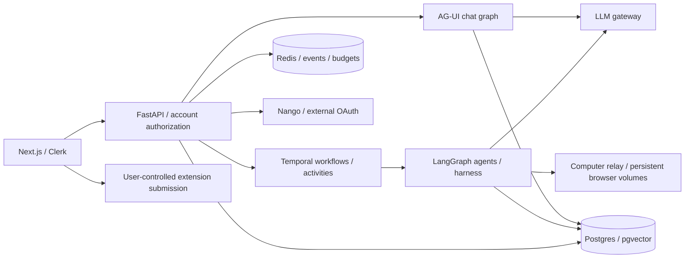

# Code, architecture, security and PR audit

Date: 2026-10-06. Repository: CareerCraft AI. Reviewed revision: `7d3bb93cdb0cfad04087959957c08ca9a95daf9d`.

Follow-up: [remediation and rollout record](2026-10-06-remediation.md). Findings below describe the original reviewed revision.

PR: [#34 — Career workspace, Copilot sandbox and applications sprint](https://github.com/blu59204/CareerCraftsAI/pull/34), `sprint/applications-autoapply` → `master`. Local branch `feat/copilot-chat-agui` points to the same commit. The PR spans 164 files, with 28,854 additions and 6,623 deletions. Review covered the PR and surrounding repository contracts, rather than treating all repository defects as regressions.

**Recommendation: do not merge yet.** Resolve the approval/consent and erasure defects, restore CI, and address the bounded-resource and document-lifecycle issues before production rollout. Passing unit tests do not establish those invariants.

## Method and limits

Read-only audit of API authorization, agent execution, application/outreach workflows, model routing, document ingestion/retrieval, sandbox relay, account lifecycle, frontend boundaries, deployment documentation, tests and CI. Used source tracing, small isolated mocked probes, automated tests, static scanning and dependency advisories. Applied Ponytail's architecture audit guidance for deletion/consolidation candidates.

No real email, application, live sandbox action, deployment, GitHub review comment or production database mutation was performed. No secret values were inspected. Existing untracked artifacts were preserved. Findings below distinguish source-confirmed behavior and isolated probes from live deployment verification. This is a repository audit, not a penetration-test certification or a claim that every deployment configuration is safe.

## Prioritized findings

### F1 · P1 · Copilot bypasses policy-consent enforcement — PR

Sources: `backend/app/api/v1/copilot_chat.py:101–115`, `backend/app/services/copilot_history.py:24–28`, `backend/app/api/v1/deps.py:60–68`.

The mounted chat and thread routes read the authenticated Clerk identity from a ContextVar, but do not use the shared current-user dependency. Their owner lookup does not inspect `policy_accepted_at`. An authenticated, provisioned account that has not accepted policy can therefore access chat/history through routes that bypass the normal consent gate. Identity authentication alone does not enforce account eligibility.

Evidence: route introspection found zero dependencies on the mounted routes; an isolated request with a fixture identity and mocked history returned HTTP 200. The common dependency rejects unconsented accounts with HTTP 403.

Fix: apply the shared account/consent dependency to protected Copilot routes, while preserving the tool identity context. Verify that an unconsented account receives 403 for chat, thread listing and thread retrieval; approved accounts should retain owner-scoped access.

### F2 · P1 · Generated outreach can be sent without message approval — new PR entry paths into existing service

Sources: `backend/app/services/auto_apply_queue.py:299`, `backend/app/services/outreach_service.py:43–49,203–212,269–288,421–464`.

With outreach auto-send enabled and enough prior manually approved sends, `queue_outreach` creates a newly generated message in `approved` state with `approved_at=None`. `send_approved` selects on state alone, then calls Gmail. Prior approvals and standing auto-send preferences do not satisfy the repository's required checkpoint before each email send. New application/rule paths expose this existing behavior.

Evidence: the state-selection probe returns `approved` for a valid recipient with auto-send allowed; source tracing confirms the sender does not require a recorded approval of that message.

Fix: newly generated messages must remain drafts until an explicit approval binds the recipient, subject, body and attachments. Send only the approved immutable payload. Test that opted-in users with previous approvals still cannot send a new draft before approval, and edits invalidate approval.

### F3 · P1 · Account erasure does not purge computer profiles — PR integration gap

Sources: `backend/app/services/account_deletion_service.py:164–177`, `deploy/computers/relay.py:211–214`, `deploy/computers/README.md:34,50–53,71–73`.

The erasure sweep revokes integrations, removes local files/unlinked rows/Redis data and deletes the Clerk account, but has no sandbox purge step. The remote computer retains persistent profile/workspace volumes after stop. Those volumes can contain authenticated portal cookies and private downloads; the README explicitly says cookie volumes are not encrypted by the credential vault. Account deletion therefore leaves sensitive data on a separate host.

Fix: add an authenticated, owner-scoped, idempotent relay purge operation that stops the computer and removes only that owner's profile/workspace. Invoke it before completing account erasure and retry on failure. Validate with synthetic files/cookies and deletion failures; never delete another owner's volume.

### F4 · P1 · Document deletion leaves retrievable embeddings — existing repository defect

Sources: `backend/app/api/v1/rag.py:250–254,440–461`, `backend/app/services/rag_service.py:238–246`.

Deleting a document removes its SQL record and attempts file deletion, but does not remove its vector chunks. Ingestion metadata includes filename and document type without a stable document UUID; generated chunk IDs are not saved with the document. Agents can continue retrieving sensitive or obsolete facts from a document the user deleted. File deletion failures are also reduced to warnings without durable retry.

Fix: associate chunks with stable document ownership/UUID and persist their identifiers. Exclude deleted documents from retrieval immediately, then durably retry file/vector cleanup. Backfill or rebuild legacy collections. Test deletion of one of two documents: its chunks disappear while the other remains retrievable.

### F5 · P2 · Upload limits do not bound expansion or parsing — existing repository defect

Sources: `backend/app/api/v1/rag.py:192–204` and `_sniff_content_type`; `backend/app/services/rag_service.py`, `extract_text`.

The route reads the entire file before checking the 10 MB limit. ZIP validity is accepted as DOCX without decompressed-size or entry-count limits, and the parser is selected using the filename rather than the verified content type. A small compressed input can cause disproportionate memory/CPU work; normal mismatched filenames can also invoke the wrong parser.

Evidence: a safe synthetic ZIP containing a 1 MB repeated entry compressed to 1,117 bytes and was recognized as DOCX. No destructive expansion or resource-exhaustion test was run.

Fix: bounded reads, DOCX structure validation, archive entry/uncompressed/XML budgets and bounded parsing workers. Select parsers from verified format. Add explicit upload admission limits. Test oversized streams, highly compressed archives, invalid DOCX structure and extension/content mismatch.

### F6 · P2 · Stored chat exceeds model-gateway limits — PR

Sources: `backend/app/services/copilot_history.py:13–20`, `backend/app/agents/chat_orchestrator.py:443–467`, `backend/app/core/llm_gateway.py:265–274`.

History accepts 500 messages/500,000 serialized characters. The orchestrator forwards the history plus system/security messages to a gateway allowing only 100 messages and a 250,000-byte body. A chat can fail long before the advertised storage limit, after approximately 50 simple exchanges or fewer tool-heavy turns. Subsequent requests keep forwarding the same oversized history.

Evidence: a mocked valid gateway session with 101 messages returned 422; history merging accepts that count.

Fix: maintain a bounded model prompt independently from durable history, preserving complete tool-call/result groups. Use consistent byte/message limits and summary/window behavior. Test conversations past both gateway thresholds and verify continued operation without orphaned tool results.

### F7 · P2 · Chat has unbounded process checkpoints and inconsistent admission — PR

Sources: `backend/app/agents/chat_orchestrator.py:405–431,501`, `backend/app/services/copilot_history.py`, `backend/app/api/v1/copilot_chat.py`, `backend/app/api/v1/agents.py:67`.

The singleton graph uses `InMemorySaver`, retaining thread/checkpoint versions for the process lifetime alongside SQL conversation history. There is no explicit checkpoint retention/erasure policy. Turn serialization is per thread; separate threads can run concurrently without the normal agent-run admission path. Chat logs completed model calls rather than reserving a running agent slot before work. This permits resource growth and bypasses the application's stated two-concurrent-runs invariant.

Fix: own retention and per-user admission in one execution layer. The installed AG-UI adapter calls `aget_state`, `aupdate_state` and state history, so removing the checkpointer is not a drop-in fix. Use a bounded/persistent checkpoint implementation with explicit retention/erasure, or deliberately adapt that integration to SQL-owned state. Atomically reserve per-user execution/budget capacity before model work. Test concurrent distinct threads, abandoned threads, restarts and account erasure.

### F8 · P2 · Live job results bypass catalog relevance filtering — PR

Sources: `backend/app/services/job_search_service.py:256–263,287–303`; catalog filtering and job matching callers.

Catalog search applies title/location predicates, but live adapter results are normalized and merged without the same role/location checks. Final filtering handles work mode only. Ranking scores candidates without removing mismatches. A cold search can therefore return results that a later catalog search would reject.

Evidence: an isolated cold-catalog/JobSpy probe returned a New York Finance Analyst for a Software Engineer search in Bengaluru.

Fix: share relevance/location predicates between cached and live candidates before ranking/output. Preserve appropriately broad catalog ingestion independently of response filtering. Test warm/cold parity, multiple cities and remote rules.

### F9 · P2 · HNSW index creation is incompatible with the vector schema — existing repository defect

Sources: `backend/app/services/rag_service.py:190–225`; installed `langchain_postgres` PGVector implementation.

PGVector is instantiated without `embedding_length`, producing an unconstrained vector column. The code attempts a direct HNSW index on that column, although the installed library documents that dimensions must be specified for indexing. Provider-specific collection names do not create separate physical embedding columns. Failure is caught as a warning, silently losing the mandated production index.

Fix: choose dimension-specific physical storage or dimension-specific partial expression indexes and matching query expressions. Preserve supported 768/1024/1536-dimensional providers; forcing one global dimension breaks provider switching. Validate actual index creation and query plans in a disposable pgvector database. This conclusion is based on schema/library inspection; no live database index test was run.

### F10 · P2 · Rule-driven resume work bypasses the agent-run lifecycle — PR

Sources: `backend/app/services/auto_apply_queue.py:198–222`; `backend/app/agents/resume_agent.py`.

Rule tailoring invents a run UUID and calls `resume_agent_node` directly. This path does not create an `AgentRun` or enter the normal harness that owns run status, input/output, duration and token accounting. The node does not create that missing audit record itself. Scheduled substantive AI work therefore has a different observability/admission contract from API-started work.

Fix: route this operation through the existing durable execution/harness boundary, preserving application association and idempotency. Verify success/failure records, model token accounting and per-user concurrency for scheduled tailoring.

## CI and validation

| Check | Result |
|---|---|
| Backend unit + security suites, complete `.venv` | **1,352 passed, 63 skipped**, one warning |
| Frontend tests | **25 passed** |
| Frontend TypeScript | Passed |
| Frontend production build | Passed: compilation, TypeScript, 45 static pages and final optimization |
| Frontend lint | Failed: unused `hoistLayers`, `frontend/scripts/vendor-copilot-css.mjs:9` |
| Bandit, 33,103 Python LOC | 0 high, 0 medium, 8 low |
| Python locked-dependency advisory scan | 204 packages; no known advisories returned |
| Frontend production-dependency advisory scan | 1 high, 7 low; 0 critical/moderate |

Current GitHub Actions run **37429859366** has three failing gates:

1. `backend-quality`: `requirements.lock` differs from canonical resolver output, stopping later quality steps. Regenerate using the repository's canonical Python 3.12/universal resolver, rather than hand editing.
2. `frontend-lint-typecheck`: unused `hoistLayers`. Remove the unused function after preserving the active CSS transformation.
3. `backend-workflow-integration-test`: 40 passed, one failed. `test_auto_apply_queue_tailors_attaches_and_starts_only_safe_jobs` expected `{queued: 1, skipped: 1}` and received zero/zero. The fixture lacks a realistic rule enablement timestamp, and its `_tailor` replacement uses the previous two-argument signature rather than the current three arguments. Update the fixture and prove the original safety behavior; do not remove its assertions.

Extension checks and E2E collection passed; live smoke was skipped. CodeRabbit's successful status represents a skipped/manual-required review, not approval. No submitted GitHub reviews or inline comments were returned by the API.

The frontend high advisory is `source-map-js@1.2.1`, GHSA-68fv-2mgg-jv7q, via PostCSS: indexed-map offsets can cause event-loop DoS; fixed in 1.2.2+. The inspected use is primarily build tooling; an attacker-controlled production runtime path was not established. Low advisories include KaTeX 0.16.47, GHSA-238p-pmpm-9mq7, which requires existing prototype pollution; fixed in 0.18.2+. Update through compatible upstream dependencies and validate rendering/builds. Do not blindly apply npm's suggested CopilotKit downgrade. Advisory absence is not proof of dependency safety.

## Architecture assessment

The major architectural risk is inconsistent ownership of shared invariants across execution and storage paths. A coherent solution should reuse the existing account authorization, durable execution, approval and erasure boundaries rather than adding local exceptions to every feature.

Additional improvements, distinct from confirmed security defects:

- **Execution:** keep interactive conversation responsive, but delegate substantial resume/application work to the existing durable workflow/harness. Centralize admission, budgets, action logging and approval handling.
- **Memory:** `app/agents/memory` and `backend/memory` own separate memory schemas/lifecycles. Define one ownership, export, retention and erasure contract across both. The generic ORM export loop does not cover standalone asyncpg memory tables; assess this coverage before promising a complete export.
- **Search:** consolidate relevance/normalization contracts between scheduled discovery and interactive catalog/live search. Avoid fixing each adapter differently.
- **Applications:** `backend/app/api/v1/jobs.py:875` loads filtered rows before Python pagination/counting. Move filters/counts/limits into SQL and add a stable ID tie-breaker for equal sort timestamps. Benchmark against realistic retained application counts.
- **Database connections:** preserve fresh-loop safety in worker paths. A naive change from NullPool to a shared asyncpg pool can reintroduce event-loop ownership failures.
- **Rollout:** computer deployment documentation already calls the sandbox a test boundary and notes Chromium sandbox limitations. Production rollout requires verifying isolation, cookie storage, network policy and cleanup on the actual host; those live controls were not certified here.

### Complexity cleanup candidates (no removals performed)

1. **Delete after confirming no external consumers:** legacy `backend/app/tools/pdf_service.py` (111 lines) and `ats_service.py` (96 lines). Whole-tree references found exports/stale documentation, while active resume work uses `app/services`. Remove corresponding exports and correct documentation. Do not remove the entire tools package.
2. **Delete after confirming no external consumers:** `backend/app/services/sse_service.py` (61 lines), an unreferenced legacy publisher alongside the active event bus.
3. **Delete:** unused `hoistLayers` in `frontend/scripts/vendor-copilot-css.mjs` (approximately 18 lines); it also breaks lint.

These candidates remove approximately 286 implementation lines plus export cleanup. Reference searches are evidence of internal non-use, not proof that out-of-repository clients do not exist. Consolidation of execution/memory boundaries matters more than the raw line savings.

## Defenses observed

- Owner-scoped queries across credentials, documents, agent runs and applications.
- AES-256-GCM credential encryption with randomized nonce/salt.
- Public-fetch SSRF checks for HTTPS/port 443, public DNS addresses, pinned connections, redirect revalidation and bounded responses; operator allowlists for Ollama endpoints.
- Nango webhook HMAC verification with constant-time comparison and replay handling.
- Atomic application submit transitions under row locks; unknown external outcomes are not blindly retried.
- Reviewed computer action payloads with run/snapshot checks and human approval markers.
- Agent model calls generally use the gateway boundary rather than passing provider credentials to the browser agent.

These controls are meaningful source-level defenses. Their presence does not eliminate the gaps identified above or establish live infrastructure enforcement.

## Remediation order

1. Restore consent enforcement and per-message send approval; add regression checks for bypass routes.
2. Complete deletion across sandbox, vectors and files with owner-scoped durable retries.
3. Restore all CI gates and compatible dependency patches.
4. Bound chat prompts/checkpoints and parsing; unify per-user admission and rule-driven audit records.
5. Fix search parity and dimension-aware indexing; validate on disposable integration infrastructure.
6. Consolidate memory/export contracts, push application pagination into SQL, and remove verified legacy helpers.

Remaining validation limits: 63 skipped backend tests, no local rerun of live provider/sandbox flows or database-backed integration suite, no production configuration/container/image audit against a running deployment, and no external exploit testing.
