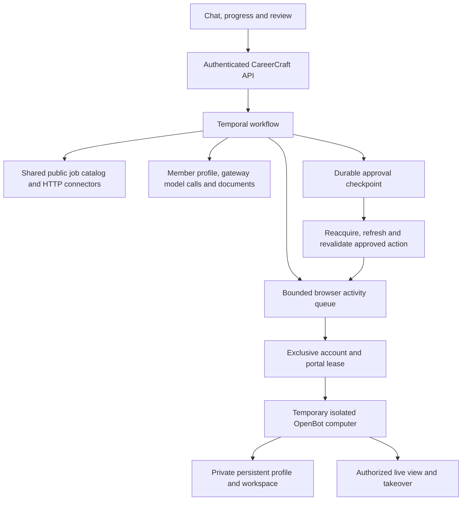

# Browser-on-demand architecture

Date: 2026-10-05. Proposed architecture for the requested CareerCraft sandbox;
the browser fleet is not implemented or benchmarked yet.

## Capacity follows active browser work

10,000 online members do not require 10,000 active computers. Members can chat,
search the shared catalog, generate documents, inspect history, and wait for
approval without a browser process. Provision browser capacity for the time
spent on website interactions, with a visible queue when capacity is exhausted.
If all 10,000 members demand an immediately available live browser, the browser
resource cost still applies; multiplexing cannot make that requirement free.

## Execution paths

### Reuse existing owners

- `job_search_service.search_all_platforms` already serves the shared catalog
  first and fills gaps through live adapters. Public HTTP connector families
  include Greenhouse, Lever, Ashby, and SmartRecruiters. Current default
  search skips live adapters when sufficiently fresh, relevant catalog data
  exists. Explicit platform selection can still trigger live fetching.
- `job_catalog.refresh_source` already holds a persisted per-source lease and
  backs off after failures. `public-job-catalog-refresh` is scheduled hourly.
  Keep public job discovery shared; never place member-specific portal data
  or logged-in pages in that shared cache.
- Existing model routing, document generation, approvals, application attempts,
  and Temporal workflow state remain authoritative. Do not allocate a computer
  merely because a chat turn or an agent run starts.
- Preserve extension execution as an existing route. It performs form work in
  the member's own browser. Add a container route without reviving retired host
  browser execution or silently changing running application workflows.

### Add the computer layer only for browser stages

1. Classify task stages: catalog lookup, permitted HTTP fetch, model/document
   work, approval wait, or website interaction. Use Chromium for the last stage.
   Public job-list APIs do not imply access to an employer's submission API.
2. Browser activities use a separate Temporal task queue and independent worker
   concurrency so slow websites cannot consume document/model worker slots.
   Enforce fleet capacity across replicas, not with a process-local semaphore.
3. Assign an exclusive lease for the account/portal profile and a worker host.
   A lease has an owner, expiry, heartbeat, and fencing generation. An old worker
   must lose access before another worker can use the same browser/profile.
   Lease expiry must stop the old container before releasing its capacity.
4. Each allocated computer belongs to exactly one account. Use OpenBot's narrow
   supervisor API and per-computer derived token, with a supervisor on each
   browser host. The app receives no Docker socket. Reuse worker hardware, not
   a dirty browser/profile between accounts. Keep user volumes separate.
5. Release the computer after a completed browser stage and flush the profile.
   Keep a small, bounded warm pool for interactive demand. Never allocate a
   browser for all stored accounts or keep one alive during hours of waiting.
6. Persist semantic progress, artifacts, and a safe review snapshot before a
   long approval wait. A cookie/profile save is not a running page snapshot:
   arbitrary unsaved forms and JavaScript state may be lost on shutdown.
   Retain a short bounded live lease when a form cannot be reconstructed;
   otherwise reopen and refill without submitting on resume.
7. Bind final approval to the member, application, reviewed fields/documents,
   target origin, and review version. Refresh the page on resume. If the form
   or proposed action materially changed, require another review. Old element
   references cannot be reused after restart or takeover.
8. Keep submission behind the existing attempt ledger. On an uncertain outcome,
   stop and reconcile; do not resubmit automatically. An HTTP route, key press,
   or shell command cannot become an alternative way around approval.
9. Stream live browser frames only for a connected authorized viewer. During
   other stages, display real task progress, artifacts, and clearly labeled
   saved screenshots. Do not represent a saved image as a live running computer.

### Secret handling

Portal credentials and browser sessions stay account-scoped. The model may
request login using a credential reference; only a trusted exact-origin
injection path handles decrypted passwords. Shell, arbitrary scripts, cookie
export, password reveal, and profile reads are not model capabilities. Private
login/takeover input must bypass chat, model traces, and recordings. Encrypt
sensitive profile storage and backups; normal Docker volumes do not themselves
provide the credential vault's encryption guarantees.

## Example sizing, not a measured traffic forecast

Let `arrival_rate` be task arrivals per second, `browser_fraction` the fraction
requiring a browser stage, and `browser_seconds` the mean total browser lease
time per such task, including page loads and any live waiting. Then:

`mean_active_browsers = arrival_rate × browser_fraction × browser_seconds`

Divide by a target utilization (for example 0.70) for an initial pool size;
validate bursts, tail latency, retry amplification, and human takeover with
load tests. This average calculation does not guarantee a queue-time target.

| Illustrative input | Value |
| --- | ---: |
| Tasks arriving per hour | 10,000 |
| Tasks with a browser stage | 20% |
| Mean browser lease per browser task | 120 seconds |
| Mean active browsers | 66.7 |
| Initial pool at 70% target utilization | 96, rounded to 100 |

Using the conservative planning allowance of 1 vCPU and 2 GB RAM per browser,
four browser hosts with 32 vCPU and 64 GB RAM each could initially cap at 25
sessions per host. That provides 100 browser slots from 128 vCPU and 256 GB RAM.
This excludes the application, database, Temporal, Redis, object storage,
operating-system overhead beyond the remaining host capacity, model-provider
quotas, and network capacity. Host specifications are a load-test starting point,
not a promise that 10,000 online members will meet a particular latency target.

If 10,000 tasks arrive in one burst and 2,000 need a 2-minute browser stage,
100 slots require 20 waves, or approximately 40 minutes to finish those stages.
If every task needs that browser stage, the same pool needs approximately 200
minutes. Larger pools buy shorter queues; API/cache work buys lower browser
usage. Do not conceal this tradeoff in a claim of 10,000 concurrent browsers.

## Deployment and proof

Start with a small bounded local pool, a real visible browser, a mock employer
portal, and explicit idle release. Prove account isolation, private login,
takeover, profile persistence, review after restore, duplicate suppression,
and uncertain-outcome handling before increasing capacity.

Measure catalog hit rate, browser-stage fraction, browser-seconds per task,
queue wait p50/p95, live lease count, CPU/RAM p95, session start time, failure
and retry rates, token consumption, and screen bandwidth. Base production
capacity and plan quotas on these measurements rather than registered users.

## Primary references

- [Browserbase contexts](https://docs.browserbase.com/platform/browser/core-features/contexts):
  persisted authentication and site data can be reused in later sessions;
  context persistence and website-session validity are distinct.
- [Browserbase concurrency](https://docs.browserbase.com/optimizations/concurrency/overview):
  session concurrency and creation rate are separate capacity limits.
- [Temporal workers](https://docs.temporal.io/develop/worker-performance):
  task queues and worker slots decouple task arrival from execution capacity.
- [Greenhouse Job Board API](https://docs.greenhouse.io/job-board.html):
  public GET data needs no authentication, but application POST needs an
  employer Job Board API key.
- [OpenDots computers](https://github.com/CopilotKit/OpenDots/blob/main/docs/COMPUTERS.md):
  isolated container lifecycle and persistent volumes, with controlled takeover.
# Implemented test deployment

The bounded browser pool is now deployed on SSH `24gb`. Eight lightweight
fixture browsers used at most 1.82 GiB combined RAM in sampled observations;
simultaneous first navigation + snapshot averaged 3.297 seconds. These measured
results supersede unverified per-user resource assumptions for that fixture.
They do not extrapolate to every career portal or to 10,000 active browsers.
See [full measurements and implementation status](sandbox-24gb-results.md).
